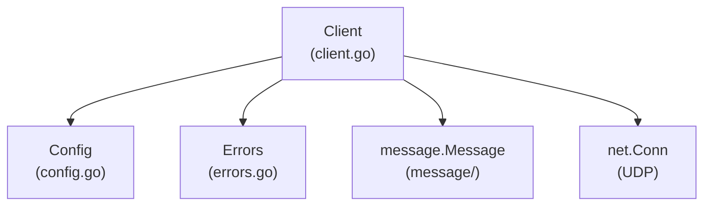
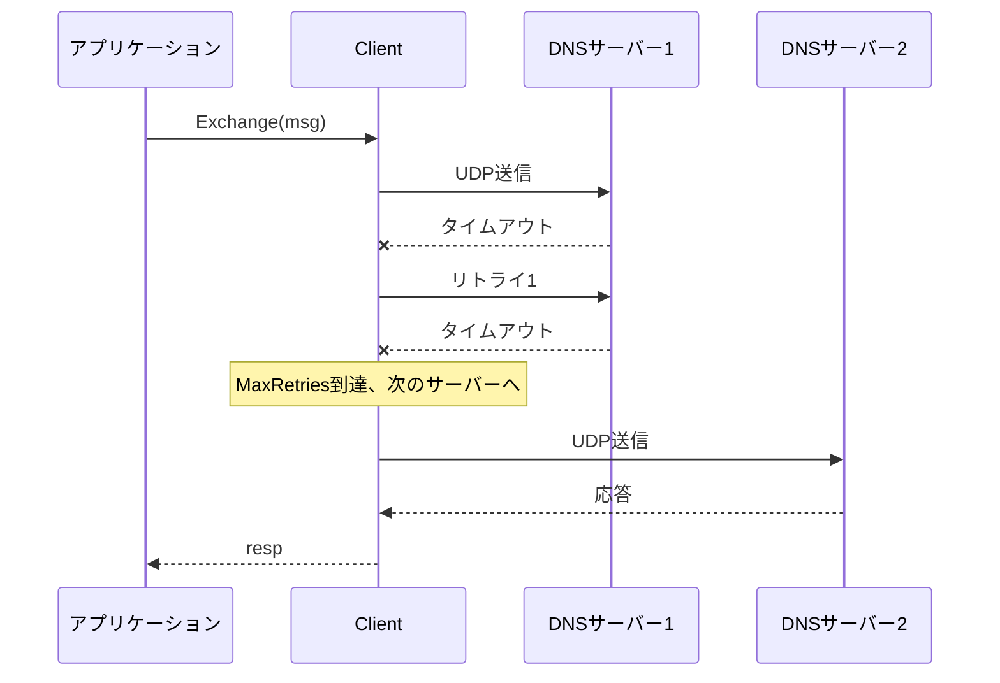
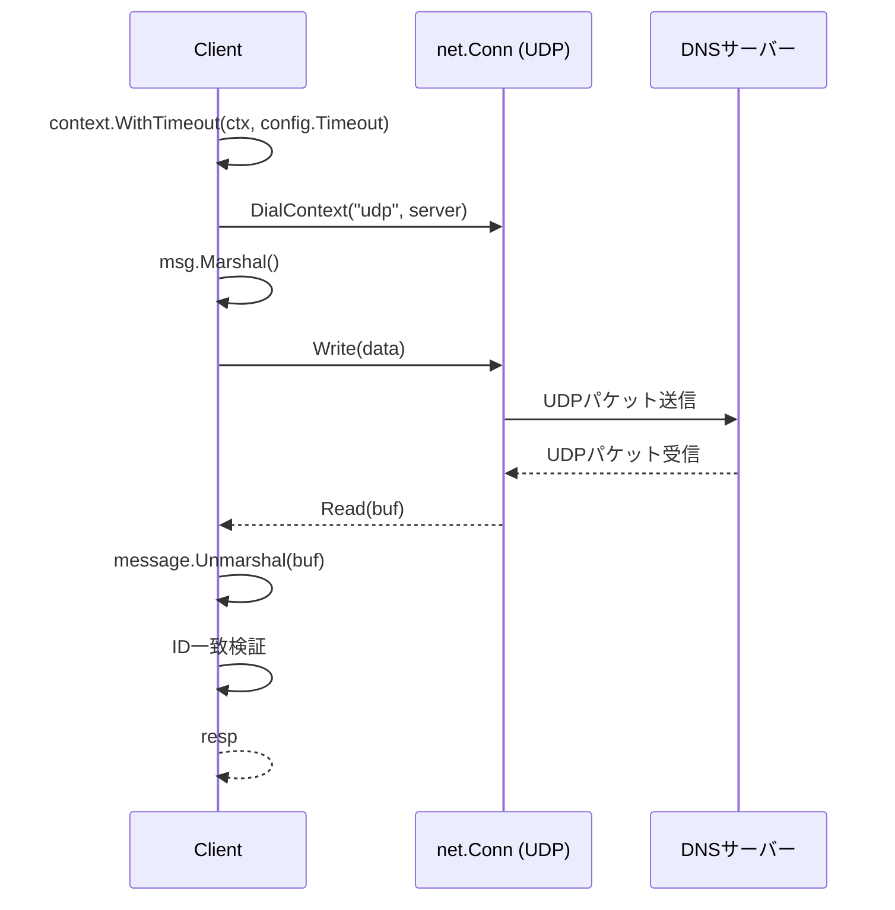

# clientパッケージの実装

`client`パッケージはDNSスタブリゾルバ（DNSクライアント）として、DNSサーバーへのクエリ送信と応答受信を担当します。

## 1. `client`の責務

`client`の役割は、`message`パッケージで構築したDNSクエリをUDPソケット経由でDNSサーバーに送信し、応答を受信して`message.Message`に変換することです。

- Query: ドメイン名とレコードタイプを指定してDNSクエリを実行（簡易API）
- Exchange: 構築済みの`message.Message`を送受信（詳細API）

名前解決アルゴリズム（反復的クエリ、キャッシュ）はこのパッケージの範囲外で、`resolver`パッケージが担う想定です。

| 処理 | 担当パッケージ |
|---|---|
| DNSメッセージのエンコード/デコード | message |
| DNSサーバーへのクエリ送受信 | **client** |
| 権威サーバーとしての応答 | server（今後実装） |
| 反復的な名前解決・キャッシュ | resolver（今後実装） |

## 2. ファイル構成

```
client/
├── client.go       # Client構造体とQuery/Exchange/exchangeメソッド
├── config.go       # Config構造体とFunctional Optionsパターン
├── errors.go       # カスタムエラー定義
└── client_test.go  # テストコード（モックDNSサーバー含む）
```

### 全体像



## 3. 型とDNS仕様の対応

| Go型 | 役割 |
|---|---|
| `Client` | DNSクエリを実行するスタブリゾルバ。Configを保持し、Query/Exchangeメソッドを提供 |
| `Config` | クライアントの設定（DNSサーバーリスト、タイムアウト、リトライ回数、リトライ間隔） |
| `Option` | Configを変更する関数型（Functional Optionsパターン） |
| `ServerError` | 特定のサーバーへのクエリ失敗を表すエラー型 |

## 4. APIの使い方

### 簡易API: Query

ドメイン名とレコードタイプを指定するだけでクエリを実行できます。

```go
c := client.NewClient(
    client.WithServers("8.8.8.8:53", "8.8.4.4:53"),
)

resp, err := c.Query(ctx, "example.com", message.TypeA)
if err != nil {
    log.Fatal(err)
}

for _, ans := range resp.Answers {
    fmt.Println(ans.RData) // 93.184.216.34
}
```

内部では以下の処理が行われます。

1. ランダムな16bit IDを生成
2. 末尾にドットがなければ追加（FQDN形式に正規化）
3. `message.Message`を構築（RD=1で再帰的解決を要求）
4. `Exchange`を呼び出し

### 詳細API: Exchange

構築済みの`message.Message`を直接送受信します。Questionセクションに複数のクエリを含めたい場合や、特殊なフラグを設定したい場合に使用します。

```go
msg := &message.Message{
    Header: message.Header{
        ID: 0x1234,
        RD: true,
    },
    Questions: []message.Question{
        {Name: "example.com.", Type: message.TypeA, Class: message.ClassIN},
    },
}

resp, err := c.Exchange(ctx, msg)
```

## 5. 設定（Config）とFunctional Optionsパターン

### Config構造体

```go
type Config struct {
    Servers    []string      // DNSサーバーリスト (例: "8.8.8.8:53")
    Timeout    time.Duration // 1回のクエリのタイムアウト
    MaxRetries int           // 最大リトライ回数
    RetryDelay time.Duration // リトライ間隔
}
```

### デフォルト値

| 設定項目 | デフォルト値 |
|---|---|
| Timeout | 2秒 |
| MaxRetries | 3回 |
| RetryDelay | 0（即時リトライ） |

### Functional Optionsパターン

`NewClient`は可変長のOption関数を受け取り、デフォルト設定を上書きします。

```go
c := client.NewClient(
    client.WithServers("8.8.8.8:53", "1.1.1.1:53"),
    client.WithTimeout(5*time.Second),
    client.WithMaxRetries(5),
    client.WithRetryDelay(100*time.Millisecond),
)
```

このパターンの利点は以下の通りです。

- 引数の順序を気にしなくてよい
- 必要な設定だけを指定できる
- 後から新しいオプションを追加しても既存コードが壊れない

## 6. リトライ・フェイルオーバーの流れ

`Exchange`メソッドは、設定された全サーバーに対してフェイルオーバーを行います。



### 処理の階層

| メソッド | 役割 |
|---|---|
| `Exchange` | 全サーバーへのフェイルオーバー |
| `exchangeWithRetry` | 単一サーバーへのリトライ |
| `exchange` | 単一サーバーへの1回の送受信 |

### 擬似コード

```
Exchange(msg):
    for server in config.Servers:
        resp, err = exchangeWithRetry(msg, server)
        if err == nil:
            return resp
        lastErr = ServerError{Server: server, Err: err}
    return ErrAllServersFailed

exchangeWithRetry(msg, server):
    for attempt in 0..config.MaxRetries:
        if attempt > 0:
            sleep(config.RetryDelay)
        resp, err = exchange(msg, server)
        if err == nil:
            return resp
    return lastErr
```

## 7. exchange（UDP通信）の内部処理

`exchange`メソッドが1回のDNSクエリ送受信を行います。



### 実装のポイント

1. **コンテキストによるタイムアウト**: `context.WithTimeout`でタイムアウト付きのコンテキストを作成
2. **UDP接続**: `net.Dialer.DialContext`でUDP接続を確立
3. **メッセージのエンコード**: `msg.Marshal()`でバイト列に変換
4. **送信**: `conn.Write(data)`でUDPパケットを送信
5. **受信バッファ**: 4096バイト（EDNS0対応を想定）
6. **読み取りデッドライン**: コンテキストのデッドラインを`SetReadDeadline`に設定
7. **デコード**: `message.Unmarshal(buf[:n])`で応答をパース
8. **ID検証**: 送信したクエリのIDと応答のIDが一致することを確認

### ID検証の重要性

DNSはUDPを使用するため、応答が本当に自分のクエリに対するものかを確認する必要があります。攻撃者が偽の応答を送り込む「DNSキャッシュポイズニング」を防ぐため、クエリIDの検証は必須です。

```go
if resp.Header.ID != msg.Header.ID {
    return nil, fmt.Errorf("id mismatch: sent %d, received %d", msg.Header.ID, resp.Header.ID)
}
```

## 8. エラーハンドリング

### センチネルエラー

| エラー | 意味 |
|---|---|
| `ErrNoServers` | DNSサーバーが設定されていない |
| `ErrAllServersFailed` | 全てのDNSサーバーへのクエリが失敗 |
| `ErrTruncated` | レスポンスが切り詰められている（将来のTCP対応用） |

### ServerError

特定のサーバーへのクエリ失敗を表す構造体です。`Unwrap()`を実装しているため、`errors.Is`や`errors.As`で内部エラーを検査できます。

```go
type ServerError struct {
    Server string
    Err    error
}

func (e *ServerError) Error() string {
    return fmt.Sprintf("server %s: %v", e.Server, e.Err)
}

func (e *ServerError) Unwrap() error {
    return e.Err
}
```

### エラーの伝播

各層でエラーをラップしながら伝播させ、最終的なエラーメッセージで失敗箇所を特定できます。

```
all DNS servers failed: server 8.8.8.8:53: read: i/o timeout
```

## 9. テストの構成

`client_test.go`には以下のテストが含まれています。

| テスト | 内容 |
|---|---|
| `TestNewClient_DefaultConfig` | デフォルト設定の検証 |
| `TestNewClient_WithOptions` | オプション設定の検証 |
| `TestExchange_NoServers` | サーバー未設定時のエラー |
| `TestExchange_Success` | モックサーバーを使った正常系 |
| `TestExchange_Timeout` | タイムアウトの検証 |

### モックDNSサーバー

テスト用のUDPサーバーを起動し、固定のレスポンスを返します。クエリのIDをレスポンスにコピーすることで、ID検証が通るようにしています。

```go
func mockDNSServer(t *testing.T, response []byte) (addr string, close func()) {
    conn, _ := net.ListenPacket("udp", "127.0.0.1:0")
    go func() {
        buf := make([]byte, 512)
        for {
            n, clientAddr, _ := conn.ReadFrom(buf)
            // クエリのIDをレスポンスにコピー
            responseCopy := make([]byte, len(response))
            copy(responseCopy, response)
            responseCopy[0] = buf[0] // ID上位
            responseCopy[1] = buf[1] // ID下位
            conn.WriteTo(responseCopy, clientAddr)
        }
    }()
    return conn.LocalAddr().String(), func() { conn.Close() }
}
```

## 10. selfdig CLIツール

`client`パッケージを使用したdigクローンとして、`cmd/selfdig`を提供しています。

### 使い方

```bash
# 基本的な使い方（デフォルトサーバー: 8.8.8.8）
selfdig example.com

# サーバーを指定
selfdig @1.1.1.1 google.com

# レコードタイプを指定
selfdig google.com MX
selfdig @8.8.8.8 cloudflare.com AAAA
```

### 出力例

```
; <<>> selfdig 0.1 <<>> @8.8.8.8:53 example.com A

;; QUESTION SECTION:
;example.com.           	IN	A

;; ANSWER SECTION:
example.com.	300	IN	A	93.184.216.34

;; Query time: 42 msec
;; SERVER: 8.8.8.8:53
;; MSG SIZE rcvd: 56
```

### 対応レコードタイプ

A, AAAA, NS, CNAME, MX, TXT, SOA

### インストール

```bash
go install ./cmd/selfdig
```

## 11. 今後の拡張

現在の実装はUDPのみに対応しています。今後のフェーズで以下の拡張が想定されています。

| 拡張 | 内容 |
|---|---|
| TCP対応 | TCビット（切り詰め）が設定された場合のTCPフォールバック |
| EDNS0 | 拡張DNSによる大きなUDPペイロードサイズのネゴシエーション |
| DNSSEC検証 | 応答の署名検証 |
