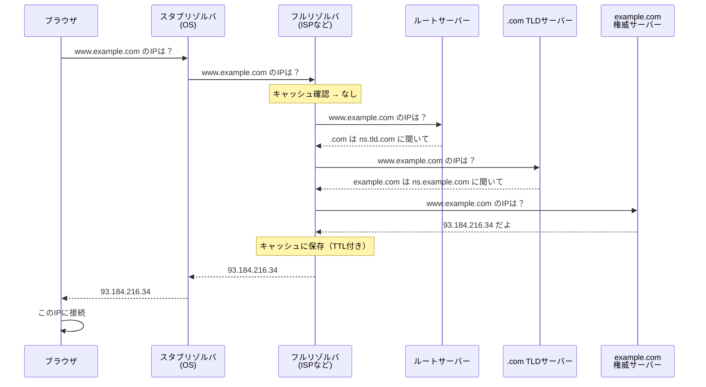

## DNSサーバーとは

DNSサーバーとはドメイン名とIPアドレスを変換する仕組みを管理・提供するサーバーです。インターネット上でパケットの送受信に使用されるIPプロトコルは、パケットの宛先や送信元をIPアドレスで表します。しかしIPアドレスは数値の羅列であり、人間にとっては覚えにくいものです。そこで、「www.example.com」のように、ドメイン名で通信先を指定することを可能にしています。実際に通信で使用するのはIPアドレスであるため、DNSサーバーがドメイン名とIPアドレスに変換（名前解決）する役割を担います。

## 名前解決の仕組み

ブラウザに `www.example.com` を入力してからIPアドレスが得られるまでの流れを説明します。

### 全体の流れ



1. ユーザーがブラウザに `www.example.com` を入力します。 
2. ブラウザがOSの**スタブリゾルバ**に名前解決を依頼します。
3. スタブリゾルバが設定された**フルリゾルバ**（ISPやGoogle 8.8.8.8など）に問い合わせを行ます。
4. フルリゾルバがキャッシュを確認。あればそれを返して終了します。
5. キャッシュになければ、**ルートサーバー**に問い合わせます。
6. ルートサーバーは「.comのことは.com TLDサーバーに聞いて」と**参照（リファラル）**を返却します。
7. フルリゾルバが **.com TLDサーバー**に問い合わせます。
8. .com TLDサーバーは「example.comのことはns.example.comに聞いて」と参照を返却します。
9. フルリゾルバが **example.comの権威サーバー**に問い合わせます。
10. 権威サーバーが `www.example.com` のAレコード（93.184.216.34）を返却します。
11. フルリゾルバが結果をキャッシュし（TTL期間）、スタブリゾルバに返却します。
12. スタブリゾルバがブラウザに返し、ブラウザがそのIPに接続します。

### 再帰的クエリと反復的クエリ

名前解決には2種類のクエリ方式があります。

| 方式 | 説明 | 使用箇所 |
|-----|------|---------|
| **再帰的クエリ** | 「最終的な答えをください」と依頼。相手が代わりに全部調べてくれる | スタブリゾルバ → フルリゾルバ |
| **反復的クエリ** | 「知っていることを教えて」と依頼。知らなければ「〇〇に聞いて」と参照を返す | フルリゾルバ → 各権威サーバー |

スタブリゾルバは「答えだけほしい」ので再帰的クエリを使い、フルリゾルバが代わりに木構造を辿って調べます。フルリゾルバは各権威サーバーに反復的クエリを投げ、参照を辿りながら最終的な答えに到達します。

### キャッシュの役割

フルリゾルバは一度調べた結果をキャッシュします。キャッシュには**TTL（Time To Live）**が設定されており、TTLが切れるまでは権威サーバーに再問い合わせせずにキャッシュから応答します。

```
例: www.example.com A 93.184.216.34 TTL=300

→ 300秒間はキャッシュから応答
→ 300秒後に再度権威サーバーに問い合わせ
```

これにより、権威サーバーへの負荷を軽減しつつ、名前解決を実現しています。

## DNSの構成

### スタブリゾルバ

### フルリゾルバ

### 権威サーバー


## DNSの階層的な名前空間 ＋ 分散データベース

### 階層的な名前空間
DNSの名前はファイルシステムのディレクトリ構造のように、木構造（ツリー）になっています。例えば www.example.com. は右から左に読むと以下の通りになります。

```
.  (ルート)
└── com
    └── example
        └── www
```

一番右の . がルート、その下に com、さらにその下に example、さらにその下に www という具合に、階層が深くなるほど具体的な名前になります。各階層は別々の管理者に委任できるので、「.comは誰が管理」「example.comは誰が管理」というように権限を分割しています。

#### 分散データベース
DNS全体のデータ（世界中の全ドメインの情報）を1台のサーバーが持っているわけではなく、上記の木構造に沿って多数のサーバーに分散して保持されています。

- ルートサーバー: .comや.orgなどTLD（トップレベルドメイン）サーバーの場所だけを知っている
- .comのTLDサーバー: example.comを管理する権威サーバーの場所だけを知っている
- example.comの権威サーバー: www.example.comなど実際のレコード（Aレコードなど）を持っている

名前解決はこの2つを組み合わせたプロセスです。

`www.example.com`を検索した時、ルート→.com→example.comと、木を上から下に辿りながら、各階層を管理するサーバーに順番に問い合わせていきます。「1台のデータベースに全部問い合わせる」のではなく、「木構造に沿って管理を分散させ、都度近い階層のサーバーに聞きに行く」という設計により、単一障害点を避けつつ、スケールする名前解決を実現しています。

### なぜDNSが必要になったのか？

DNSの設計者自身が「なぜHOSTS.TXTが限界を迎えたか」「なぜ階層＋分散という設計を選んだか」を振り返って書いた論文があり、DNSが生まれた背景が記載されています。

https://www.cs.cornell.edu/courses/cs6411/2018sp/papers/mockapetris.pdf

DNSが生まれる以前は**HOSTS.TXTファイルという単一の集中管理方式**が存在しました。当時ARPANETでは、全ホスト名とIPアドレスの対応表を1つのファイル（HOSTS.TXT）にまとめ、SRI-NICという1つの組織が管理・配布し、各ホストがそれを定期的にダウンロードして使っていました。

しかしネットワークの規模が拡大するにつれ、以下の問題が発生しました。
- ファイルサイズが肥大化し配布コストが増大
- 更新のたびに全ホストが同期し直す必要があり、更新頻度に限界
- 中央の1組織が全ての名前登録を捌く必要があり、管理が破綻

DNSの「階層的な名前空間＋分散データベース」は、この単一集中管理の問題を解決するための設計です。名前空間の木構造そのものに意味を持たせず、名前が何を表すかはノードに付随するデータ(リソースレコード)を見て判断します。名前空間を木構造に分割することで管理権限そのものを委任でき（example.comの管理は.comの管理者と独立）、データも各ゾーンの権威サーバーに分散することになります。

キャッシュTTL(Time To Live)付きでレスポンスをキャッシュし、権威あるサーバへの問い合わせを減らす

### 通常はUDPを採用している理由

UDP 通常のクエリ（512バイト以下、高速）
TCP 応答が大きい場合（TCビット）、ゾーン転送（AXFR/IXFR）

TCPは通信の前に3-way handshakeが必要であり、「本来送りたいデータ」を送る前に、往復のやり取りが発生する。DNSのクエリは「名前を1つ送って、アドレスを1つ受け取る」という単純なやりとり。このやり取りのために、まずTCPのハンドシェイクで往復1回分の遅延を払うのは割に合わない。UDPなら、すぐ本題のパケットを送信可能となる。また、UDPはコネクションレス、つまり「状態を持たない」プロトコル。1つのクエリ=1つの独立したパケットなので、経路がその時々で不安定でも、ダメだったらそのクエリ単体をもう一度送るだけで済みます。壊れたコネクションを再構築する必要がありません。

## ゾーンと委任
NSレコードによる委任の仕組み

## グルーレコード
委任時の循環参照問題と解決策


┌───────────────────┬──────────────┬──────────────────────────────┐
  │     トピック      │ 対応フェーズ │             内容             │
  ├───────────────────┼──────────────┼──────────────────────────────┤
  │ TCPフォールバック │ 4            │ TCビット、512バイト超の応答  │
  ├───────────────────┼──────────────┼──────────────────────────────┤
  │ EDNS0             │ 6            │ 拡張DNS、大きなUDPペイロード │
  ├───────────────────┼──────────────┼──────────────────────────────┤
  │ DNSSEC            │ 6            │ 署名検証、信頼の連鎖         │
  └───────────────────┴──────────────┴──────────────────────────────┘


  ## セキュリティ
  キャッシュポイズニング、DNS増幅攻撃
