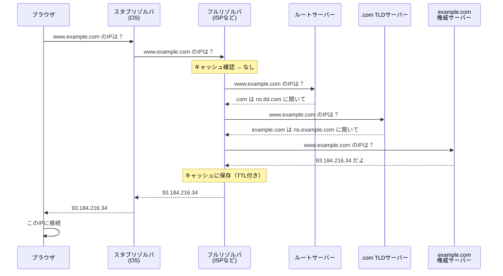

本章では、実装に入る前に、DNSサーバーの各機能の役割について解説していきます。

## DNSサーバーとは何か？

DNSサーバーとはドメイン名とIPアドレスを変換する仕組みを管理・提供するサーバーです。インターネット上でパケットの送受信に使用されるIPプロトコルは、パケットの宛先や送信元をIPアドレスで表します。しかしIPアドレスは数値の羅列であり、人間にとっては覚えにくいものです。そこで、`www.example.com`のように、ドメイン名で通信先を指定することを可能にしています。実際に通信で使用するのはIPアドレスであるため、DNSサーバーがドメイン名とIPアドレスに変換（名前解決）する役割を担います。

## 名前解決の流れ

ブラウザに `www.example.com`を入力してからIPアドレスが得られるまで様々なルートを通って名前解決が行われます。

1. ユーザーがブラウザに `www.example.com` を入力すると、ブラウザがOSの**スタブリゾルバ**に名前解決を依頼します
2. 依頼されたスタブリゾルバは設定された**フルリゾルバ**（ISPやGoogle 8.8.8.8など）に問い合わせを行ます
3. フルリゾルバがキャッシュを確認。あればそれを返して終了します
4. キャッシュになければ、**ルートサーバー**に問い合わせます。ルートサーバーは「.comのことは.com TLDサーバーに聞いて」と**参照（リファラル）**を返却します
5. フルリゾルバが **.com TLDサーバー**に問い合わせます。.com TLDサーバーは「example.comのことはns.example.comに聞いて」と参照を返却します
6. フルリゾルバが **example.comの権威サーバー**に問い合わせます。権威サーバーが `www.example.com` のAレコード（93.184.216.34）を返却します
7. フルリゾルバが結果をキャッシュし（TTL期間）、スタブリゾルバに返却します
8. スタブリゾルバがブラウザに返し、ブラウザがそのIPに接続します




### 再帰的クエリと反復的クエリについて

名前解決を依頼する際には2種類のクエリが存在します。

| 方式 | 説明 | 使用箇所 |
|-----|------|---------|
| **再帰的クエリ** | スタブリゾルバ「最終的なIPアドレスをください」と依頼する。フルリゾルバが代わりに調べてくれる | スタブリゾルバ → フルリゾルバ |
| **反復的クエリ** | フルリゾルバが「知っていることを教えて」と依頼する。知らなければ「〇〇に聞いて」と参照を返す | フルリゾルバ → 各権威サーバー |

スタブリゾルバは「答えだけほしい」ので再帰的クエリを使い、、フルリゾルバが代わりに木構造を辿って調べます。その後、フルリゾルバは各権威サーバーに反復的クエリを投げ、参照を辿りながら最終的な回答（IPアドレス）を確認し、スタブリゾルバに返却します。

### キャッシュの役割

フルリゾルバは一度調べた結果をキャッシュします。キャッシュには**TTL（Time To Live）**が設定されており、TTLが切れるまでは権威サーバーに再度問い合わせせずにキャッシュから応答できます。

```
例: www.example.com A 93.184.216.34 TTL=300
→ 300秒間はキャッシュから応答
→ 300秒後に再度権威サーバーに問い合わせ
```
これにより、権威サーバーへの負荷を軽減しつつ、名前解決を実現しています。


## DNSの構成

### スタブリゾルバ

スタブリゾルバは、アプリケーション（ブラウザやメールソフトなど）からの名前解決要求を受け付け、フルリゾルバに問い合わせを転送するクライアントです。OSに組み込まれており、自身では再帰的な名前解決を行いません。

主な役割は以下の通りです。
- アプリケーションからの名前解決リクエストを受け付ける
- 設定されたフルリゾルバ（`/etc/resolv.conf`やシステム設定で指定）に問い合わせを転送する
- フルリゾルバからの応答をアプリケーションに返却する

スタブリゾルバは「再帰的クエリ」を使用し、「最終的な答えをください」とフルリゾルバに依頼します。複雑な名前解決の処理はすべてフルリゾルバに任せる設計になっています。

### フルリゾルバ

フルリゾルバ（再帰リゾルバ、キャッシュDNSサーバーとも呼ばれます）は、スタブリゾルバからの問い合わせを受けて、実際に名前解決を行うサーバーです。ISPやGoogle Public DNS（8.8.8.8）、Cloudflare DNS（1.1.1.1）などが代表的な例です。

主な役割は以下の通りです。

- スタブリゾルバからの再帰的クエリを受け付ける
- ルートサーバーから順に権威サーバーを辿り、最終的な回答を取得する（反復的クエリ）
- 取得した結果をTTLに基づいてキャッシュする
- キャッシュがある場合は、権威サーバーに問い合わせずにキャッシュから応答する

フルリゾルバは「反復的クエリ」を使用して各権威サーバーに問い合わせます。各サーバーは「次はここに聞いて」という参照を返すため、フルリゾルバはその参照を辿って最終的なIPアドレスに到達し、スタブリゾルバに回答を返却することができます。

### 権威サーバー

権威サーバー（権威DNSサーバー）は、特定のドメイン（ゾーン）のDNSレコードを管理しており、そのドメインに関する問い合わせに対しての「回答」を返却するサーバーです。

主な役割は以下の通りです。
- 管理するゾーンのリソースレコード（A、AAAA、MX、CNAMEなど）を保持する
- 自身が管理するゾーンへの問い合わせに対して、回答を返却する
- サブドメインを別のサーバーに委任する場合は、NSレコードで委任先を設定します


| 種類 | 説明 |
|-----|------|
| **ルートサーバー** | DNS階層の最上位。TLDサーバーへの参照を返します。世界中に13のルートサーバー群（a.root-servers.net〜m.root-servers.net）が分散配置されています |
| **TLDサーバー** | .com、.org、.jpなどのトップレベルドメインを管理します。各ドメインの権威サーバーへの参照を返します |
| **ドメインの権威サーバー** | example.comなど個別ドメインを管理します。実際のAレコードやMXレコードなどを保持しています |


## DNSの階層的な名前空間 ＋ 分散データベースについて

### 階層的な名前空間
DNSの名前はファイルシステムのディレクトリ構造のように、木構造（ツリー）になっています。例えば`www.example.com.`は右から左に読むと以下のようになります。

```
.  (ルート)
└── com
    └── example
        └── www
```

一番右の . がルート、その下に com、さらにその下に example、さらにその下に www という具合に、階層が深くなるほど具体的な名前になります。各階層は別々の管理者に委任できるので、「.comは誰が管理」「example.comは誰が管理」というように権限を分割しています。

#### 分散データベース
DNS全体のデータ（世界中の全ドメインの情報）を1台のサーバーが持っているわけではなく、上記の木構造に沿って多数のサーバーに分散して保持されています。

- ルートサーバー: .comや.orgなどTLD（トップレベルドメイン）サーバーの場所だけを知っている
- .comのTLDサーバー: example.comを管理する権威サーバーの場所だけを知っている
- example.comの権威サーバー: www.example.comなど実際のレコード（Aレコードなど）を持っている

名前解決はこの2つを組み合わせたプロセスです。

`www.example.com`を検索した時、ルート→.com→example.comと、木を上から下に辿りながら、各階層を管理するサーバーに順番に問い合わせていきます。「1台のデータベースに全部問い合わせる」のではなく、「木構造に沿って管理を分散させ、都度近い階層のサーバーに聞きに行く」という設計により、単一障害点を避けつつ、スケールする名前解決を実現しています。

### なぜDNSが必要になったのか？

DNSの設計者自身が「なぜHOSTS.TXTが限界を迎えたか」「なぜ階層＋分散という設計を選んだか」を振り返って書いた論文があり、DNSが生まれた背景が記載されています[[MOCKAPETRIS]](#参考文献)。

DNSが生まれる以前は**HOSTS.TXTファイルという単一の集中管理方式**が存在しました。当時ARPANETでは、全ホスト名とIPアドレスの対応表を1つのファイル（HOSTS.TXT）にまとめ、SRI-NICという1つの組織が管理・配布し、各ホストがそれを定期的にダウンロードして使っていました。

しかしネットワークの規模が拡大するにつれ、様々な問題が発生しました。
- ファイルサイズが肥大化し配布コストが増大
- 更新のたびに全ホストが同期し直す必要があり、更新頻度に限界
- 中央の1組織が全ての名前登録を捌く必要があり、管理が破綻

DNSの階層的な名前空間＋分散データベースは、この単一集中管理の問題を解決するための設計です。名前空間の木構造そのものに意味を持たせず、名前が何を表すかはノードに付随するデータ（リソースレコード）を見て判断します。名前空間を木構造に分割することで管理権限そのものを委任でき（example.comの管理は.comの管理者と独立）、データも各ゾーンの権威サーバーに分散することになります。
さらに、フルリゾルバがTTL（Time To Live）付きでレスポンスをキャッシュすることで、権威サーバーへの問い合わせ回数を減らし、効率的な名前解決を行っています。

### DNSが通常はUDPを採用している理由

DNSでは基本的には、トランスポート層のプロトコルとしてUDPを使用しています。

| プロトコル | 使用場面 |
|-----------|---------|
| **UDP** | 通常のクエリ（512バイト以下）、高速な応答が必要な場合 |
| **TCP** | 応答が大きい場合（TCビットが立った応答）、ゾーン転送（AXFR/IXFR） |

**1. 3-way handshakeの省略**
TCPは通信の前に3-way handshakeが必要であり、本来送りたいデータを送る前に往復のやり取りが発生します。DNSのクエリは「名前を1つ送って、アドレスを1つ受け取る」という単純なやりとりであり、UDPならすぐに本題のパケットを送信することが可能です。

**2. コネクションレスの利点**
UDPはコネクションレスであり、状態を持たないプロトコルです。1つのクエリ = 1つの独立したパケットなので、経路がその時々で不安定でも、失敗したらそのクエリ単体をもう一度送るだけで済みます。コネクションが壊れても再構築する必要はありません。

**3. サーバー側のリソース効率**
フルリゾルバや権威サーバーは大量のクライアントからの問い合わせを処理します。TCPの場合、各接続ごとに状態を管理する必要がありますが、UDPではその必要がないため、より多くのリクエストを処理できます。

#### TCPを使用する場面

応答サイズが512バイトを超える場合、権威サーバーは応答のヘッダに**TCビット（Truncated bit）**を立てて「応答が切り詰められた」ことを示します。クライアントはこのTCビットを検出すると、同じクエリをTCPで再送信し、応答を取得します。

また、**ゾーン転送**（権威サーバー間でゾーンデータを同期する処理）では、大量のデータを確実に転送する必要があるため、最初からTCPを使用します。

## ゾーンと委任

ゾーンとは、DNSの名前空間において、ある管理者が権限を持って管理する範囲のことを指します。

- **ドメイン**： 名前空間の論理的な階層構造（example.comとそのすべてのサブドメイン）
- **ゾーン**： 実際に1つの権威サーバーが管理する範囲

例えば、ドメイン`example.com`はそれだけではなく、`www.example.com、`mail.example.com`、`api.example.com`、さらに`v1.api.example.com`まで、その配下にある全ての名前を含む論理的な集合です。
一方でゾーンは、「この範囲は、この権威サーバーが責任を持って回答します」という運用上の単位を指します。

ある組織が最初は`example.com`というドメイン全体を1つのゾーン(権威サーバーA)がまるごと管理していたとします。組織が「APIまわりは別チームに任せたい」と判断し、`api.example.com`以下の管理を別チームに引き渡す(＝委任する)とします。権威サーバーAのゾーンファイルに、`api.example.com`のNSレコード(この先は権威サーバーBに聞いてくださいという意味)を追加し、`api.example.com`以下の実体(`v1.api.example.com`など)は権威サーバーBのゾーンファイルに移動します、

```
example.com ドメイン ← 論理的な集合(www, mail, api...すべて含む)
│
├── example.com ゾーン（権威サーバーA が管理）
│   ├── www.example.com   ← Aが直接回答
│   ├── mail.example.com  ← Aが直接回答
│   └── api.example.com への委任（NSレコード）
│
└── api.example.com ゾーン（権威サーバーB が管理）← 委任先の別ゾーン
    ├── v1.api.example.com ← Bが直接回答
    └── v2.api.example.com ← Bが直接回答
```
この時点で、`example.com`という1つのドメインの中に、`example.com`ゾーン(権威サーバーA管轄)と`api.example.com`ゾーン(権威サーバーB管轄)という2つのゾーンが存在することになります。この場合権威サーバーAに`v1.api.example.com`を聞いても、Aは「知りません、Bに聞いてください」としか答えられません。これが「委任」の仕組みです。


### NSレコードによる委任

委任は**NSレコード（Name Server Record）**によって行われます。親ゾーンが「このサブドメインは別のネームサーバーに聞いてください」という情報を保持します。

```
; example.com ゾーンファイル（親ゾーン）
example.com.        IN  NS  ns1.example.com.
example.com.        IN  NS  ns2.example.com.
www.example.com.    IN  A   93.184.216.34
mail.example.com.   IN  A   93.184.216.35

; api.example.com を別のサーバーに委任
api.example.com.    IN  NS  ns1.api.example.com.
api.example.com.    IN  NS  ns2.api.example.com.
```

この委任により、`api.example.com`以下の名前解決は`ns1.api.example.com`や`ns2.api.example.com`が担当することになります。

**NSレコード + グルーレコード**
NSにはNSレコードだけでなく、グルーレコードが存在します。
例えば、`google.com NS`と問い合わせると、`google.com`のネームサーバーとして`ns1.google.com.`のような名前が返ってきます。そこで一点問題が発生します。
- `ns1.google.com`に問い合わせたいが、そのためには`ns1.google.com`のIPアドレスが必要
- `ns1.google.com`のIPアドレスを知るには、DNSで名前解決が必要だが、その名前解決を頼みたい相手が、`ns1.google.com`自身という状況です。

「`.com`の中の名前を教えてくれるはずのサーバー自身も、`.com`の中の名前(`ns1.google.com`)を持っている」というケースがあり、名前解決が堂々巡りになってしまいます。この問題を避けるため、`.com`のTLDサーバーは、`NSレコード(google.com. NS ns1.google.com.)`を返す際に、「`ns1.google.com`のIPアドレスはこれです」というA/AAAAレコードをAdditionalセクションに一緒に格納して返却します。これがグルーレコードです。

### SOAレコード（Start of Authority）
SOA(Start of Authority)レコードは、個々の名前解決(AやNSなど)のためのレコードというよりも、「このゾーンを管理しているのは誰で、どういうルールで運用されているか」というゾーン自体のメタ情報を表すレコードです。1つのゾーンに必ず1つだけ存在します。

```
example.com.  SOA  ns1.example.com. admin.example.com. (
     2024010101  ; シリアル番号（更新の度に増やす）
     3600        ; リフレッシュ間隔（セカンダリが確認する頻度）
     900         ; リトライ間隔（失敗時の再試行間隔）
     604800      ; 有効期限（これを過ぎたら古いデータを破棄）
     86400       ; ネガティブキャッシュ(「レコードは存在しない」という否定応答)をキャッシュしてよい時間の目安
 )
```

---

## 参考文献

- [RFC1034] Mockapetris, P., "Domain Names - Concepts and Facilities", STD 13, RFC 1034, November 1987.
  https://www.rfc-editor.org/rfc/rfc1034
- [RFC1035] Mockapetris, P., "Domain Names - Implementation and Specification", STD 13, RFC 1035, November 1987.
  https://www.rfc-editor.org/rfc/rfc1035
- [MOCKAPETRIS] Mockapetris, P. and Dunlap, K., "Development of the Domain Name System", SIGCOMM '88.
  https://www.cs.cornell.edu/courses/cs6411/2018sp/papers/mockapetris.pdf
