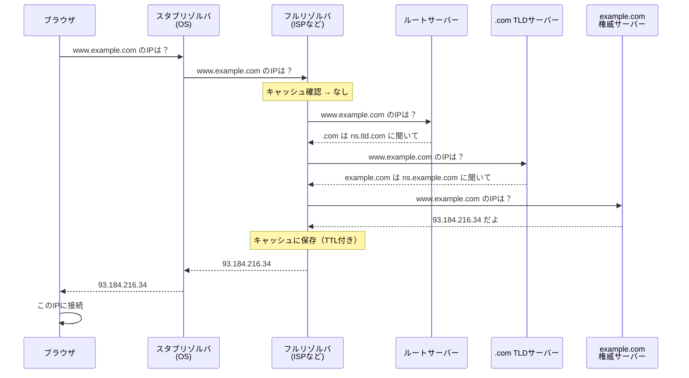

## DNSサーバーとは

DNSサーバーとはドメイン名とIPアドレスを変換する仕組みを管理・提供するサーバーです。インターネット上でパケットの送受信に使用されるIPプロトコルは、パケットの宛先や送信元をIPアドレスで表します。しかしIPアドレスは数値の羅列であり、人間にとっては覚えにくいものです。そこで、「www.example.com」のように、ドメイン名で通信先を指定することを可能にしています。実際に通信で使用するのはIPアドレスであるため、DNSサーバーがドメイン名とIPアドレスに変換（名前解決）する役割を担います。

## 名前解決の仕組み

ブラウザに `www.example.com` を入力してからIPアドレスが得られるまでの流れを説明します。

### 全体の流れ



1. ユーザーがブラウザに `www.example.com` を入力します。 
2. ブラウザがOSの**スタブリゾルバ**に名前解決を依頼します。
3. スタブリゾルバが設定された**フルリゾルバ**（ISPやGoogle 8.8.8.8など）に問い合わせを行ます。
4. フルリゾルバがキャッシュを確認。あればそれを返して終了します。
5. キャッシュになければ、**ルートサーバー**に問い合わせます。
6. ルートサーバーは「.comのことは.com TLDサーバーに聞いて」と**参照（リファラル）**を返却します。
7. フルリゾルバが **.com TLDサーバー**に問い合わせます。
8. .com TLDサーバーは「example.comのことはns.example.comに聞いて」と参照を返却します。
9. フルリゾルバが **example.comの権威サーバー**に問い合わせます。
10. 権威サーバーが `www.example.com` のAレコード（93.184.216.34）を返却します。
11. フルリゾルバが結果をキャッシュし（TTL期間）、スタブリゾルバに返却します。
12. スタブリゾルバがブラウザに返し、ブラウザがそのIPに接続します。

### 再帰的クエリと反復的クエリ

名前解決には2種類のクエリ方式があります。

| 方式 | 説明 | 使用箇所 |
|-----|------|---------|
| **再帰的クエリ** | 「最終的な答えをください」と依頼。相手が代わりに全部調べてくれる | スタブリゾルバ → フルリゾルバ |
| **反復的クエリ** | 「知っていることを教えて」と依頼。知らなければ「〇〇に聞いて」と参照を返す | フルリゾルバ → 各権威サーバー |

スタブリゾルバは「答えだけほしい」ので再帰的クエリを使い、フルリゾルバが代わりに木構造を辿って調べます。フルリゾルバは各権威サーバーに反復的クエリを投げ、参照を辿りながら最終的な答えに到達します。

### キャッシュの役割

フルリゾルバは一度調べた結果をキャッシュします。キャッシュには**TTL（Time To Live）**が設定されており、TTLが切れるまでは権威サーバーに再問い合わせせずにキャッシュから応答します。

```
例: www.example.com A 93.184.216.34 TTL=300

→ 300秒間はキャッシュから応答
→ 300秒後に再度権威サーバーに問い合わせ
```

これにより、権威サーバーへの負荷を軽減しつつ、名前解決を実現しています。

## DNSの構成

### スタブリゾルバ

スタブリゾルバは、アプリケーション（ブラウザやメールソフトなど）からの名前解決要求を受け付け、フルリゾルバに問い合わせを転送する軽量なクライアントです。OSに組み込まれており、自身では再帰的な名前解決を行いません。

主な役割は以下の通りです。

- アプリケーションからの名前解決リクエストを受け付けます
- 設定されたフルリゾルバ（`/etc/resolv.conf`やシステム設定で指定）に問い合わせを転送します
- フルリゾルバからの応答をアプリケーションに返却します
- 簡易的なキャッシュを保持する実装もあります（OSによって異なります）

スタブリゾルバは「再帰的クエリ」を使用し、「最終的な答えをください」とフルリゾルバに依頼します。複雑な名前解決の処理はすべてフルリゾルバに任せる設計になっています。

### フルリゾルバ

フルリゾルバ（再帰リゾルバ、キャッシュDNSサーバーとも呼ばれます）は、スタブリゾルバからの問い合わせを受けて、実際に名前解決を行うサーバーです。ISPやGoogle Public DNS（8.8.8.8）、Cloudflare DNS（1.1.1.1）などが代表的な例です。

主な役割は以下の通りです。

- スタブリゾルバからの再帰的クエリを受け付けます
- ルートサーバーから順に権威サーバーを辿り、最終的な回答を取得します（反復的クエリ）
- 取得した結果をTTLに基づいてキャッシュします
- キャッシュがある場合は、権威サーバーに問い合わせずにキャッシュから応答します

フルリゾルバは「反復的クエリ」を使用して各権威サーバーに問い合わせます。各サーバーは「次はここに聞いて」という参照（リファラル）を返すため、フルリゾルバはその参照を辿って最終的な答えに到達します。

### 権威サーバー

権威サーバー（権威DNSサーバー、Authoritative DNS Serverとも呼ばれます）は、特定のドメイン（ゾーン）のDNSレコードを管理し、そのドメインに関する問い合わせに対して「権威ある回答」を返すサーバーです。

主な役割は以下の通りです。

- 管理するゾーンのリソースレコード（A、AAAA、MX、CNAMEなど）を保持します
- 自身が管理するゾーンへの問い合わせに対して、権威ある回答（Authoritative Answer）を返します
- サブドメインを別のサーバーに委任する場合は、NSレコードで委任先を示します

権威サーバーには以下の種類があります。

| 種類 | 説明 |
|-----|------|
| **ルートサーバー** | DNS階層の最上位。TLDサーバーへの参照を返します。世界中に13のルートサーバー群（a.root-servers.net〜m.root-servers.net）が分散配置されています |
| **TLDサーバー** | .com、.org、.jpなどのトップレベルドメインを管理します。各ドメインの権威サーバーへの参照を返します |
| **ドメインの権威サーバー** | example.comなど個別ドメインを管理します。実際のAレコードやMXレコードなどを保持しています |


## DNSの階層的な名前空間 ＋ 分散データベース

### 階層的な名前空間
DNSの名前はファイルシステムのディレクトリ構造のように、木構造（ツリー）になっています。例えば www.example.com. は右から左に読むと以下の通りになります。

```
.  (ルート)
└── com
    └── example
        └── www
```

一番右の . がルート、その下に com、さらにその下に example、さらにその下に www という具合に、階層が深くなるほど具体的な名前になります。各階層は別々の管理者に委任できるので、「.comは誰が管理」「example.comは誰が管理」というように権限を分割しています。

#### 分散データベース
DNS全体のデータ（世界中の全ドメインの情報）を1台のサーバーが持っているわけではなく、上記の木構造に沿って多数のサーバーに分散して保持されています。

- ルートサーバー: .comや.orgなどTLD（トップレベルドメイン）サーバーの場所だけを知っている
- .comのTLDサーバー: example.comを管理する権威サーバーの場所だけを知っている
- example.comの権威サーバー: www.example.comなど実際のレコード（Aレコードなど）を持っている

名前解決はこの2つを組み合わせたプロセスです。

`www.example.com`を検索した時、ルート→.com→example.comと、木を上から下に辿りながら、各階層を管理するサーバーに順番に問い合わせていきます。「1台のデータベースに全部問い合わせる」のではなく、「木構造に沿って管理を分散させ、都度近い階層のサーバーに聞きに行く」という設計により、単一障害点を避けつつ、スケールする名前解決を実現しています。

### なぜDNSが必要になったのか？

DNSの設計者自身が「なぜHOSTS.TXTが限界を迎えたか」「なぜ階層＋分散という設計を選んだか」を振り返って書いた論文があり、DNSが生まれた背景が記載されています。

https://www.cs.cornell.edu/courses/cs6411/2018sp/papers/mockapetris.pdf

DNSが生まれる以前は**HOSTS.TXTファイルという単一の集中管理方式**が存在しました。当時ARPANETでは、全ホスト名とIPアドレスの対応表を1つのファイル（HOSTS.TXT）にまとめ、SRI-NICという1つの組織が管理・配布し、各ホストがそれを定期的にダウンロードして使っていました。

しかしネットワークの規模が拡大するにつれ、以下の問題が発生しました。
- ファイルサイズが肥大化し配布コストが増大
- 更新のたびに全ホストが同期し直す必要があり、更新頻度に限界
- 中央の1組織が全ての名前登録を捌く必要があり、管理が破綻

DNSの「階層的な名前空間＋分散データベース」は、この単一集中管理の問題を解決するための設計です。名前空間の木構造そのものに意味を持たせず、名前が何を表すかはノードに付随するデータ（リソースレコード）を見て判断します。名前空間を木構造に分割することで管理権限そのものを委任でき（example.comの管理は.comの管理者と独立）、データも各ゾーンの権威サーバーに分散することになります。

さらに、フルリゾルバがTTL（Time To Live）付きでレスポンスをキャッシュすることで、権威サーバーへの問い合わせ回数を大幅に減らし、効率的な名前解決を実現しています。

### 通常はUDPを採用している理由

DNSでは通常、トランスポート層のプロトコルとしてUDPを使用します。TCPを使用する場面もありますが、限定的です。

| プロトコル | 使用場面 |
|-----------|---------|
| **UDP** | 通常のクエリ（512バイト以下）、高速な応答が必要な場合 |
| **TCP** | 応答が大きい場合（TCビットが立った応答）、ゾーン転送（AXFR/IXFR） |

#### UDPが選ばれる理由

**1. オーバーヘッドの削減**

TCPは通信の前に3-way handshakeが必要であり、「本来送りたいデータ」を送る前に往復のやり取りが発生します。DNSのクエリは「名前を1つ送って、アドレスを1つ受け取る」という単純なやりとりです。このやり取りのために、まずTCPのハンドシェイクで往復1回分の遅延を払うのは効率的ではありません。UDPならすぐに本題のパケットを送信できます。

**2. コネクションレスの利点**

UDPはコネクションレス、つまり「状態を持たない」プロトコルです。1つのクエリ = 1つの独立したパケットなので、経路がその時々で不安定でも、失敗したらそのクエリ単体をもう一度送るだけで済みます。壊れたコネクションを再構築する必要がありません。

**3. サーバー側のリソース効率**

フルリゾルバや権威サーバーは大量のクライアントからの問い合わせを処理します。TCPの場合、各接続ごとに状態を管理する必要がありますが、UDPではその必要がないため、より多くのリクエストを効率的に処理できます。

#### TCPへのフォールバック

応答サイズが512バイトを超える場合、権威サーバーは応答のヘッダに**TCビット（Truncated bit）**を立てて「応答が切り詰められた」ことを示します。クライアントはこのTCビットを検出すると、同じクエリをTCPで再送信し、応答を取得します。

また、**ゾーン転送**（権威サーバー間でゾーンデータを同期する処理）では、大量のデータを確実に転送する必要があるため、最初からTCPを使用します。

## ゾーンと委任

### ゾーンとは

ゾーンとは、DNSの名前空間において、ある管理者が権限を持って管理する範囲のことです。

- **ドメイン**: 名前空間の論理的な階層構造（example.comとそのすべてのサブドメイン）
- **ゾーン**: 実際に1つの権威サーバー（群）が管理する範囲

例えば、`example.com`ドメインを持つ組織が`api.example.com`を別チームに委任した場合、`example.com`ゾーンと`api.example.com`ゾーンは別々の権威サーバーで管理されます。

```
example.com ドメイン
├── example.com ゾーン（権威サーバーA）
│   ├── www.example.com
│   ├── mail.example.com
│   └── api.example.com への委任（NSレコード）
│
└── api.example.com ゾーン（権威サーバーB）← 委任された別ゾーン
    ├── v1.api.example.com
    └── v2.api.example.com
```

### NSレコードによる委任

委任は**NSレコード（Name Server Record）**によって行われます。親ゾーンが「このサブドメインは別のネームサーバーに聞いてください」という情報を保持します。

```
; example.com ゾーンファイル（親ゾーン）
example.com.        IN  NS  ns1.example.com.
example.com.        IN  NS  ns2.example.com.
www.example.com.    IN  A   93.184.216.34
mail.example.com.   IN  A   93.184.216.35

; api.example.com を別のサーバーに委任
api.example.com.    IN  NS  ns1.api.example.com.
api.example.com.    IN  NS  ns2.api.example.com.
```

この委任により、`api.example.com`以下の名前解決は`ns1.api.example.com`や`ns2.api.example.com`が担当することになります。

## グルーレコード

### 委任時の循環参照問題

委任の際、問題が発生するケースがあります。例えば、`example.com`を管理するネームサーバーが`ns1.example.com`という名前だった場合を考えます。

```
example.com.    IN  NS  ns1.example.com.
```

この場合、以下の循環参照（chicken-and-egg problem）が発生します。

1. `www.example.com`を解決するには、`example.com`の権威サーバーを知る必要があります
2. 権威サーバーは`ns1.example.com`です
3. しかし`ns1.example.com`のIPアドレスを知るには、`example.com`の権威サーバーに聞く必要があります
4. → 永遠に解決できません

### グルーレコードによる解決

この問題を解決するのが**グルーレコード（Glue Record）**です。親ゾーン（この例では.comのTLDサーバー）が、委任先ネームサーバーのIPアドレスも一緒に保持します。

```
; .com TLDゾーン（親ゾーン）
example.com.        IN  NS  ns1.example.com.
example.com.        IN  NS  ns2.example.com.

; グルーレコード（委任先ネームサーバーのIPアドレス）
ns1.example.com.    IN  A   192.0.2.1
ns2.example.com.    IN  A   192.0.2.2
```

グルーレコードは、委任の応答（リファラル）に含まれる**Additional Section**で返されます。フルリゾルバは、NSレコードと一緒にネームサーバーのIPアドレスも受け取るため、循環参照を回避できます。

```
;; AUTHORITY SECTION:
example.com.        172800  IN  NS  ns1.example.com.
example.com.        172800  IN  NS  ns2.example.com.

;; ADDITIONAL SECTION:
ns1.example.com.    172800  IN  A   192.0.2.1
ns2.example.com.    172800  IN  A   192.0.2.2
```

グルーレコードが必要になるのは、ネームサーバーの名前が委任されるゾーン内にある場合（in-bailiwick）のみです。`example.com`のネームサーバーが`ns1.other.net`のように別ドメインであれば、循環参照は発生しないためグルーレコードは不要です。
