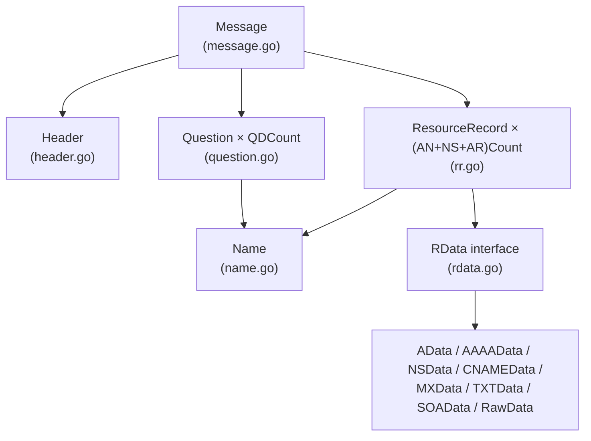

# messageパッケージの実装

本章では`message`フォルダがエンコード/デコード処理としてどのように処理しているかを解説してきます。


## 全体の流れ

`message`フォルダでは、主に名前解決で問い合わせる為のDNSメッセージをバイト列に変換（送信用）したり、バイト列からDNSメッセージに復元（受信用）する機能を実装していきます。

https://www5e.biglobe.ne.jp/aji/3min/66.html


- `message.go`: `Message`構造体を定義し、`Marshal`/`Unmarshal`でバイト列との相互変換を行います
  - `header.go`: 12バイト固定長のDNSヘッダー
  - `question.go`: 問い合わせセクション（ドメイン名・タイプ・クラス）
  - `rr.go`: リソースレコード（回答・権威・追加セクション共通）
  - `rdata.go`: レコードデータのインターフェースと具体型（A, AAAA, NS, CNAME, MX, TXT, SOA等）
  - `name.go`: ドメイン名の表現（ラベルをドットで連結、例: `"www.example.com."`、ルートは `"."`で表現）

`Message`構造体が DNSプロトコルのメッセージ構造をGoで表現したもので、RFC 1035で定義されているDNSメッセージのフォーマットをそのままGoの構造体に表現しています。
```go
type Message struct {
    Header      Header            // DNSヘッダー
    Questions   []Question        // 問い合わせセクション
    Answers     []ResourceRecord  // 回答セクション
    Authorities []ResourceRecord  // 権威セクション
    Additionals []ResourceRecord  // 追加セクション
}
```
`Marshal`/`Unmarshal`は、このGo構造体とワイヤーフォーマット（バイト列）を変換するような役割を担います。ここでは使用しませんが、後続のclient（リゾルバ）のクエリ送信時やserver（権威サーバー）の応答送信時に使用します。
- 送信: `Message`構造体 → Marshal() → バイト列 → 送信
- 受信: 受信 → バイト列 → Unmarshal() → `Message`構造体

**具体例**: `www.example.com.` のAレコードを問い合わせるクエリ
```go
// Go構造体（入力）
  msg := Message{
      Header: Header{ID: 0x1234, RD: true},
      Questions: []Question{{
          Name:  "www.example.com.",
          Type:  TypeA, // Aタイプ
          Class: ClassIN, // INクラス
      }},
  }

  // Marshal → バイト列（出力）
  data, _ := msg.Marshal()
  // data = []byte{0x12, 0x34, 0x01, 0x00, ...}

  // Unmarshal → GoのMessage構造体に戻る
  restored, _ := message.Unmarshal(data)
  // restored.Questions[0].Name == "www.example.com."
```

## ヘッダー

`header.go`ではリクエスト及びレスポンスのheader部分に関連して処理を行います。
```go
type Header struct {
    ID uint16  // クエリ識別子（クライアントが生成、応答で返される）

    // フラグフィールド（ワイヤー上は16bitにパック）
    QR     bool   // Query(false) / Response(true)
    Opcode Opcode // クエリ種別
    AA     bool   // Authoritative Answer
    TC     bool   // Truncation（メッセージ切り詰め）
    RD     bool   // Recursion Desired（再帰要求）
    RA     bool   // Recursion Available
    Z      uint8  // 予約（3bit、常に0）
    RCode  RCode  // 応答コード

    // セクション件数
    QDCount uint16  // Question数
    ANCount uint16  // Answer数
    NSCount uint16  // Authority数
    ARCount uint16  // Additional数
}
```

`marshal` 関数でクライアントから引き受けたリクエストのHeaderを読み取り、12バイト列に変換する処理を行います。
```go
func (h Header) marshal(buf []byte) []byte {
    buf = binary.BigEndian.AppendUint16(buf, h.ID)
    buf = binary.BigEndian.AppendUint16(buf, h.flags())
    buf = binary.BigEndian.AppendUint16(buf, h.QDCount)
    buf = binary.BigEndian.AppendUint16(buf, h.ANCount)
    buf = binary.BigEndian.AppendUint16(buf, h.NSCount)
    buf = binary.BigEndian.AppendUint16(buf, h.ARCount)
    return buf  // 12バイト追記されたbufを返す
}
```

`flags` は、Header構造体の各フラグを16ビットの値にする関数です。例えばHeader{RD: true}(他は全てゼロ値、再帰を要求する通常のクエリ)を渡すと、RDに対応するbit8だけが1になり flags = 0000000100000000(2進) = 0x0100 となります。
```go
// Go構造体 → 16bitフラグ値func (h Header) flags() uint16 {
	var flags uint16
	if h.QR {
		flags |= 1 << 15 // bit 15: QR
	}
	flags |= uint16(h.Opcode&0xF) << 11
	if h.AA {
		flags |= 1 << 10 // bit 10: AA
	}
	if h.TC {
		flags |= 1 << 9 // bit 9: TC
	}
	if h.RD {
		flags |= 1 << 8 // bit 8: RD
	}
	if h.RA {
		flags |= 1 << 7 // bit 7: RA
	}
	flags |= uint16(h.Z&0x7) << 4
	flags |= uint16(h.RCode & 0xF)
	return flags
}
```

`readHeader` 関数ではデコード処理を行っています。名前解決されたレスポンスのでっだー部分の12byte(ID=0x1234, flags=0x0100(RD=1のみ), QDCOUNT=1, 他0)を読み込み、`Header{ID: 0x1234, RD: true, QDCount: 1}(`のようなGoの構造体に変換します。
```go
func (d *decoder) readHeader() (Header, error) {
    // バッファ長チェック
    if len(d.buf) < headerSize {
        return Header{}, fmt.Errorf("header: buffer too short")
    }

    id, _ := d.readUint16()
    flags, _ := d.readUint16()
    qdCount, _ := d.readUint16()
    anCount, _ := d.readUint16()
    nsCount, _ := d.readUint16()
    arCount, _ := d.readUint16()

    // フラグをビット演算で各フィールドに展開
    return Header{
        ID:      id,
        QR:      flags&(1<<15) != 0,
        Opcode:  Opcode(flags>>11) & 0xF,
        AA:      flags&(1<<10) != 0,
        TC:      flags&(1<<9) != 0,
        RD:      flags&(1<<8) != 0,
        RA:      flags&(1<<7) != 0,
        Z:       uint8(flags>>4) & 0x7,
        RCode:   RCode(flags & 0xF),
        QDCount: qdCount,
        ANCount: anCount,
        NSCount: nsCount,
        ARCount: arCount,
    }, nil
}
```


## ドメイン名の処理

`name.go`でドメイン名を処理するための実装を行っていきます。
DNSの規定ではドメイン名を各ラベルの前にその長さを1バイトで付ける方式を採用しています。

https://datatracker.ietf.org/doc/html/rfc1035#section-4.1.2

```
人間が読む形式: www.example.com.
                 ↓
DNSの方式: [3] w w w [7] e x a m p l e [3] c o m [0]
         　↑         ↑                 ↑         ↑
          長さ3     長さ7             長さ3      最後
```
このDNSの方式の場合、解析時に「次の何バイトがラベルか」がすぐ把握可能で、区切り文字のエスケープ処理が不要になるという利点があります。
```go
type Name string  // 例: "www.example.com."
const (
    maxLabelLength = 63   // 各ラベルは63バイトまで
    maxNameLength  = 255  // 名前全体は255バイトまで
)

func (n Name) marshal(buf []byte) ([]byte, error) {
    labels, err := n.labels()
    if err != nil {
        return nil, err
    }

    // 長さチェック
    total := 1  // 終端の0バイト分
    for _, label := range labels {
        total += 1 + len(label)
    }
    if total > maxNameLength {
        return nil, fmt.Errorf("name %q exceeds %d bytes", n, maxNameLength)
    }

    // 各ラベルをエンコード
    for _, label := range labels {
        if len(label) > maxLabelLength {
            return nil, fmt.Errorf("label %q exceeds %d bytes", label, maxLabelLength)
        }
        buf = append(buf, byte(len(label)))  // 長さ
        buf = append(buf, label...)          // 本体
    }
    buf = append(buf, 0)  // 終端
    return buf, nil
}
```

`labels`関数でドメイン名をパーツ毎に分解します。ラベルをスライスに分解して、ドット区切りで保持し連結しています（例：`www.example.com.`をラベルのスライス（["www", "example", "com"]）に分解する処理、ルートは "."で保持）
```go
// "www.example.com." → ["www", "example", "com"]
func (n Name) labels() ([]string, error) {
    trimmed := strings.TrimSuffix(string(n), ".")
    if trimmed == "" {
        return []string{}, nil  // ルートドメイン
    }

    labels := strings.Split(trimmed, ".")
    if slices.Contains(labels, "") {
        return nil, fmt.Errorf("name %q contains an empty label", n)
    }
    return labels, nil
}
```
メッセージの中で各パーツが区切りがわかる形式（.）で格納される理由は、前述のドメイン名を各ラベルの前にその長さを1バイトで付ける方式に変換するためです。
ドット（.）形式のまま保持していた場合、ドット（.）は1バイト使用してしまいます。また、長さを保持する形式は後述する名前圧縮という利点があり、同じドメイン名が複数回出てくるとき、「さっきの位置を見て」と参照できるので、パケットサイズを節約することができます(`readName` 関数の圧縮ポインタ処理がその役割を担います)

- 形式: `www.example.com`（ドット2つ分含む16バイト）
- 形式: `3www7example3com0`（長さ情報4つ17バイト）


### デコードと名前圧縮

バイナリドメイン名を読み取り、ドット区切りのName型に変換する処理（`[3][www][7][example][3][com][0]`  →  `www.example.com.`）を`readName`関数で行っています。さらに名前圧縮も行っています。名前圧縮は簡単に言うと、 DNSメッセージ内で同じドメイン名（または末尾部分）が繰り返し出てくるとき、2回目以降は「前の位置を見て」と指し示すだけで済ませる仕組みです。
例えば、`www.example.com` と `mail.example.com` を両方送りたい場合、愚直に書くと
- [3][www][7][example][3][com][0] ← `www.example.com`
- [4][mail][7][example][3][com][0] ← `mail.example.com`

と全部書くことになり、合計: 17 + 18 = 35バイトとなります。一方で圧縮ありの場合、
- オフセット0: [3][www][7][example][3][com][0] ← `www.example.com`
- オフセット17: [4][mail][ポインタ→4]  ← mail + 「オフセット4を見て（`example.com` の開始位置を指す）」

となり、合計: 17 + 7 = 24バイトとなります。`example.com` の部分を再利用することで、圧縮しているのですね。ポインタは先頭2ビットが 11 ならポインタと判断（例：0b11000000  → 「これはポインタ」）し、残り14ビットでオフセット位置を示しており、`case length&compressionPointerMask == compressionPointerMask:`で判定しています。

```go
const (
    compressionPointerMask = 0xC0  // 0b11000000
    maxCompressionJumps    = 128   // 無限ループ防止
)

func (d *decoder) readName() (Name, error) {
	labels := []string{} // 読み取ったラベルを貯める
	cursor := d.pos      // 現在の読み取り位置
	jumped := false      // ポインタジャンプしたか
	jumps := 0           // ジャンプ回数（無限ループ防止）

    for {
        if cursor >= len(d.buf) {
            return "", fmt.Errorf("unexpected end of buffer at offset %d", cursor)
        }

        length := d.buf[cursor]

        switch {
        case length == 0:
            // 終端
            cursor++
            if !jumped {
                d.pos = cursor  // ポインタを使っていなければposを進める
            }
            return joinLabels(labels), nil

        case length&compressionPointerMask == compressionPointerMask:
            // 圧縮ポインタ
            jumps++
            if jumps > maxCompressionJumps {
                return "", fmt.Errorf("too many compression pointer jumps")
            }

            // 14bitオフセットを取得
            ptr := int(binary.BigEndian.Uint16(d.buf[cursor:cursor+2]) &^ (compressionPointerMask << 8))
            if ptr >= cursor {
                return "", fmt.Errorf("compression pointer does not point backward")
            }

            // 初回ジャンプ時のみd.posを確定
            if !jumped {
                d.pos = cursor + 2
                jumped = true
            }
            cursor = ptr  // ポインタ先へジャンプ

        case length&compressionPointerMask != 0:
            // 不正な値（01または10で始まる）
            return "", fmt.Errorf("invalid label length byte 0x%02x", length)

        default:
            // 通常のラベル
            cursor++
            if cursor+int(length) > len(d.buf) {
                return "", fmt.Errorf("label extends past end of buffer")
            }
            labels = append(labels, string(d.buf[cursor:cursor+int(length)]))
            cursor += int(length)
        }
    }
}
```
`d.pos`（外部から見える位置）と`cursor`（内部の読み取り位置）を分離することで、ポインタ追従後も呼び出し元は「ポインタ2byte分だけ読み進んだ」状態になります。


## Questionセクション

`question.go`では、DNSメッセージのQuestionセクションを扱います。「このドメイン名の、この種類のレコードを教えて」という問い合わせを表現します。

```go
type Question struct {
    Name  Name   // 問い合わせるドメイン名
    Type  Type   // レコードタイプ（A, AAAA, MX等）
    Class Class  // クラス（通常はIN）
}
```
`www.example.com` のIPアドレス(A)を問い合わせる場合、以下のようなクエリになります。

```
  Question {
      Name:  "www.example.com."
      Type:  A (= 1)
      Class: IN (= 1)
  }
```

`marshal`で送信側にバイナリ化します（"www.example.com." + A + IN → [3][www][7][example][3][com][0][00][01][00][01]）。
```go
func (q Question) marshal(buf []byte) ([]byte, error) {
    buf, err := q.Name.marshal(buf)
    if err != nil {
        return nil, fmt.Errorf("question: marshal name: %w", err)
    }

    buf = binary.BigEndian.AppendUint16(buf, uint16(q.Type))
    buf = binary.BigEndian.AppendUint16(buf, uint16(q.Class))

    return buf, nil
}
```

`readQuestion` 関数では逆に受信したバイナリを解析します。
```go
func (d *decoder) readQuestion() (Question, error) {
    name, err := d.readName()
    if err != nil {
        return Question{}, fmt.Errorf("question: read name: %w", err)
    }

    typ, err := d.readUint16()
    if err != nil {
        return Question{}, fmt.Errorf("question: read type: %w", err)
    }

    class, err := d.readUint16()
    if err != nil {
        return Question{}, fmt.Errorf("question: read class: %w", err)
    }

    return Question{Name: name, Type: Type(typ), Class: Class(class)}, nil
}
```


## リソースレコード / RDATA

`rr.go`では、名前解決のリクエスト内のAnswer/Authority/Additionalセクションを処理します。レコード種別（`A=1, NS=2, CNAME=5, AAAA=28`など）やTTL(キャッシュ)、`RData`の実装を行っています。

```go
type ResourceRecord struct {
    Name  Name    // レコードの対象ドメイン名
    Type  Type    // レコードタイプ
    Class Class   // クラス
    TTL   uint32  // 生存時間（秒）
    RData RData   // レコードデータ（Type別の実装）
}
```
`RData`は「レコードの種類（TYPE）によって中身のフォーマットが異なるデータ」を表現しています。レコードの種類（TYPE）よって、リクエストするデータが異なる理由は、ドメイン名に紐づく様々な種類の情報を格納・配布する仕組みとして設計されているからです。格納する情報の種類が異なると、フォーマットも異なります（つまり、問い合わせに必要なデータ構造も異なる）。

| TYPE | 目的 | 必要なデータ |
| --- | --- | --- |
| A | IPv4アドレスを知りたい | IPアドレス(4byte固定) |
| AAAA | IPv6アドレスを知りたい | IPアドレス(16byte固定) |
| MX | メール送信先を知りたい | 優先度 + メールサーバー名 |
| NS | 権威サーバーを知りたい | ネームサーバー名 |
| TXT | 任意のテキスト情報 | 文字列(SPF, DKIMなど) |
| SOA | ゾーンの管理情報を知りたい | 管理者、シリアル番号、各種タイマー |

```
// Aレコード（17-26行目） - 固定長
type AData struct {
    Address [4]byte  // 例: 93.184.216.34 → [93, 184, 216, 34]
}

// MXレコード（69-84行目） - 可変長
type MXData struct {
    Preference uint16  // 優先度（小さいほど優先）
    Exchange   Name    // メールサーバー名（可変長）
}

// SOAレコード（105-136行目） - 複合的な可変長
type SOAData struct {
    MName   Name    // プライマリネームサーバー
    RName   Name    // 管理者メールアドレス
    Serial  uint32  // シリアル番号
    Refresh uint32  // リフレッシュ間隔
    Retry   uint32  // リトライ間隔
    Expire  uint32  // 有効期限
    Minimum uint32  // ネガティブキャッシュTTL
}

// デコード時の分岐
func (d *decoder) readRData(typ Type, rdataEnd int) (RData, error) {
    switch typ {
     case TypeA:
         return d.readAData()
     case TypeAAAA:
         return d.readAAAAData()
     // ... 他のTYPE
     default:
        return d.readRawData(typ, rdataEnd)  // 未対応TYPEはRawDataで保持
    }
}
```

MXレコードの場合は、メール配送では「どのサーバーに送るか」だけでなく「複数あるならどれを優先するか」も必要です。その為、優先度(uint16) + サーバー名(Name) という構造になっています。
```
example.com.  MX  10  mail1.example.com.
example.com.  MX  20  mail2.example.com.
```

TXTレコードの場合は、SPFやDKIMなど、任意のテキスト情報を格納するために使われます。
```
example.com.  TXT  "v=spf1 include:_spf.google.com ~all"
```


RDATAの長さは書いてみるまで分からないため、プレースホルダを置いて後から書き戻します。
```go
func (rr ResourceRecord) marshal(buf []byte) ([]byte, error) {
    buf, err := rr.Name.marshal(buf)
    if err != nil {
        return nil, fmt.Errorf("resource record: marshal name: %w", err)
    }

    buf = binary.BigEndian.AppendUint16(buf, uint16(rr.Type))
    buf = binary.BigEndian.AppendUint16(buf, uint16(rr.Class))
    buf = binary.BigEndian.AppendUint32(buf, rr.TTL)

    // RDLENGTHの位置を記録し、プレースホルダ(0)を書き込む
    rdlengthPos := len(buf)
    buf = binary.BigEndian.AppendUint16(buf, 0)

    // RDATA本体を書き込む
    rdataStart := len(buf)
    buf, err = rr.RData.marshal(buf)
    if err != nil {
        return nil, fmt.Errorf("resource record: marshal rdata: %w", err)
    }

    // RDLENGTHを実際の長さで上書き
    rdlength := len(buf) - rdataStart
    binary.BigEndian.PutUint16(buf[rdlengthPos:rdlengthPos+2], uint16(rdlength))

    return buf, nil
}
```

デコードではドメイン名を読み取り、Name, Type, Class, TTL, RDATAんも順番に解析していきます。
```go
func (d *decoder) readResourceRecord() (ResourceRecord, error) {
	name, err := d.readName()
	if err != nil {
		return ResourceRecord{}, fmt.Errorf("resource record: read name: %w", err)
	}

	typ, err := d.readUint16()
	if err != nil {
		return ResourceRecord{}, fmt.Errorf("resource record: read type: %w", err)
	}

	class, err := d.readUint16()
	if err != nil {
		return ResourceRecord{}, fmt.Errorf("resource record: read class: %w", err)
	}

	ttl, err := d.readUint32()
	if err != nil {
		return ResourceRecord{}, fmt.Errorf("resource record: read ttl: %w", err)
	}

	rdlength, err := d.readUint16()
	if err != nil {
		return ResourceRecord{}, fmt.Errorf("resource record: read rdlength: %w", err)
	}

	rdataEnd := d.pos + int(rdlength)
	if rdataEnd > len(d.buf) {
		return ResourceRecord{}, fmt.Errorf("resource record: rdata length %d exceeds remaining buffer", rdlength)
	}

	rdata, err := d.readRData(Type(typ), rdataEnd)
	if err != nil {
		return ResourceRecord{}, fmt.Errorf("resource record: read rdata: %w", err)
	}

	if d.pos != rdataEnd {
		return ResourceRecord{}, fmt.Errorf(
			"resource record: rdata parser consumed %d bytes, want %d",
			d.pos-(rdataEnd-int(rdlength)), rdlength,
		)
	}

	return ResourceRecord{
		Name:  name,
		Type:  Type(typ),
		Class: Class(class),
		TTL:   ttl,
		RData: rdata,
	}, nil
}
```
`rdataEnd := d.pos + int(rdlength)`でRDATAパーサーが消費したバイト数がRDLENGTHと一致するか確認しています。RDLENGTHとは、DNSリソースレコードのフォーマットにおいて、RDATAフィールドの長さを示す16ビット（2バイト）の値です。
DNSメッセージには複数のリソースレコードが連続して格納されており、RDATAの長さは可変なので、次のレコードの開始位置を知るにはRDLENGTHが役に立ちます。
もし `readRData` の実装にバグがあり、読むべきバイト数より多く読んだ場合や少なく読んだ場合、次のレコードを誤った位置から読み始めてしまうため、本当に最後まで読んだか確認しています。

```
例: RDLENGTHは10バイトだがパーサーが8バイトしか読まなかった場合
┌──────────┬──────────┬──────────┐
│ RDATA1   │ RDATA1   │ 次のRR   │
│ (8bytes) │ (2bytes) │の先頭    │
└──────────┴──────────┴──────────┘
            ↑
           読み残し → 次のRRの解析が失敗する
```
 
```go
// RDATAの終了位置を事前に計算
rdataEnd := d.pos + int(rdlength)

// RDATAを読む
rdata, err := d.readRData(Type(typ), rdataEnd)

// 本当にrdataEndまで読んだか確認
if d.pos != rdataEnd {
    return ResourceRecord{}, fmt.Errorf(...)
}
```
