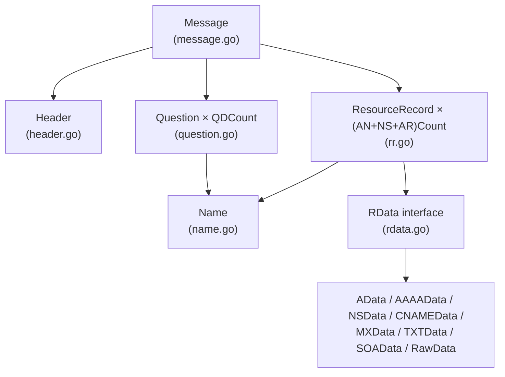

# messageパッケージの実装

DNSメッセージのバイナリ形式とGo構造体を相互変換する`message`パッケージの実装解説です。

## 目次

1. [パッケージの責務](#1-パッケージの責務)
2. [DNSメッセージの構造](#2-dnsメッセージの構造)
3. [ファイル構成と型の関係](#3-ファイル構成と型の関係)
4. [型定義（types.go）](#4-型定義typesgo)
5. [ヘッダー（header.go）](#5-ヘッダーheadergo)
6. [ドメイン名（name.go）](#6-ドメイン名namego)
7. [Question（question.go）](#7-questionquestiongo)
8. [リソースレコード（rr.go）](#8-リソースレコードrrgo)
9. [RDATA（rdata.go）](#9-rdatardatago)
10. [デコーダ（codec.go）](#10-デコーダcodecgo)
11. [メッセージ全体（message.go）](#11-メッセージ全体messagego)
12. [エラーハンドリング](#12-エラーハンドリング)

---

## 1. パッケージの責務

`message`パッケージはDNSプロトコルの**ワイヤーフォーマット変換**のみを担当します。

```
┌─────────────────────────────────────────────────────────────┐
│                    message パッケージ                        │
│                                                             │
│   Go構造体 ←──── Unmarshal ────── バイト列（ネットワーク）     │
│      │                               ↑                      │
│      └────── Marshal ────────────────┘                      │
└─────────────────────────────────────────────────────────────┘
```

他のパッケージとの責務分担：

| パッケージ | 責務 |
|-----------|------|
| `message` | バイナリ ↔ 構造体の変換 |
| `client` | UDP/TCP通信 |
| `zone` | ゾーンファイルのパース |
| `server` | クエリの受信と応答 |
| `resolver` | 再帰的名前解決とキャッシュ |

---

## 2. DNSメッセージの構造

RFC1035で定義されるDNSメッセージは以下の5つのセクションで構成されます。

```
+---------------------+
|        Header       |  12バイト固定
+---------------------+
|       Question      |  可変長 × QDCount
+---------------------+
|        Answer       |  可変長 × ANCount
+---------------------+
|      Authority      |  可変長 × NSCount
+---------------------+
|      Additional     |  可変長 × ARCount
+---------------------+
```

**具体例**: `www.example.com.` のAレコードを問い合わせるクエリ

```
バイト列（16進数）:
12 34  01 00  00 01  00 00  00 00  00 00   ← Header (12バイト)
│  │   │  │   │  │   │  │   │  │   │  │
│  │   │  │   │  │   │  │   │  │   └──┴── ARCount = 0
│  │   │  │   │  │   │  │   └──┴── NSCount = 0
│  │   │  │   │  │   └──┴── ANCount = 0
│  │   │  │   └──┴── QDCount = 1
│  │   └──┴── Flags (RD=1)
└──┴── ID = 0x1234

03 77 77 77  07 65 78 61 6d 70 6c 65  03 63 6f 6d  00   ← QNAME
 3  w  w  w   7  e  x  a  m  p  l  e   3  c  o  m  終端

00 01  00 01   ← QTYPE=A, QCLASS=IN
```

---

## 3. ファイル構成と型の関係

```
message/
├── types.go    ← Type, Class, Opcode, RCode（プロトコル定数）
├── codec.go    ← decoder（バイト列読み取りカーソル）
├── header.go   ← Header構造体
├── name.go     ← Name型（ドメイン名）
├── question.go ← Question構造体
├── rr.go       ← ResourceRecord構造体
├── rdata.go    ← RDataインターフェースと各TYPE実装
└── message.go  ← Message構造体（エントリポイント）
```

型の関係図:



---

## 4. 型定義（types.go）

DNSプロトコルで使用される定数値を型安全に扱うための定義です。

### レコードタイプ（Type）

```go
type Type uint16

const (
    TypeA     Type = 1   // IPv4アドレス
    TypeNS    Type = 2   // ネームサーバー
    TypeCNAME Type = 5   // 別名
    TypeSOA   Type = 6   // 権威情報の開始
    TypeMX    Type = 15  // メール交換
    TypeTXT   Type = 16  // テキスト
    TypeAAAA  Type = 28  // IPv6アドレス
)

func (t Type) String() string {
    switch t {
    case TypeA:
        return "A"
    case TypeNS:
        return "NS"
    // ... 省略
    default:
        return fmt.Sprintf("TYPE%d", uint16(t))  // 未知のタイプも表示可能
    }
}
```

### クラス（Class）

```go
type Class uint16

const (
    ClassIN Class = 1  // Internet（実質これのみ使用）
    ClassCS Class = 2  // 廃止
    ClassCH Class = 3  // Chaosnet
    ClassHS Class = 4  // Hesiod
)
```

### 応答コード（RCode）

```go
type RCode uint8

const (
    RCodeSuccess        RCode = 0  // NOERROR - 成功
    RCodeFormatError    RCode = 1  // FORMERR - フォーマットエラー
    RCodeServerFailure  RCode = 2  // SERVFAIL - サーバー障害
    RCodeNameError      RCode = 3  // NXDOMAIN - ドメイン不存在
    RCodeNotImplemented RCode = 4  // NOTIMP - 未実装
    RCodeRefused        RCode = 5  // REFUSED - 拒否
)
```

---

## 5. ヘッダー（header.go）

### 構造体定義

DNSヘッダーは12バイト固定で、フラグ群は個別のフィールドに展開して扱いやすくしています。

```go
const headerSize = 12

type Header struct {
    ID uint16  // クエリ識別子（クライアントが生成、応答で返される）

    // フラグフィールド（ワイヤー上は16bitにパック）
    QR     bool   // Query(false) / Response(true)
    Opcode Opcode // クエリ種別
    AA     bool   // Authoritative Answer
    TC     bool   // Truncation（メッセージ切り詰め）
    RD     bool   // Recursion Desired（再帰要求）
    RA     bool   // Recursion Available
    Z      uint8  // 予約（3bit、常に0）
    RCode  RCode  // 応答コード

    // セクション件数
    QDCount uint16  // Question数
    ANCount uint16  // Answer数
    NSCount uint16  // Authority数
    ARCount uint16  // Additional数
}
```

### フラグのビットパック

ワイヤーフォーマットでは、複数のフラグが16bitに詰め込まれています。

```
ビット配置（16bit）:
  15  14 13 12 11  10   9   8   7  6 5 4  3 2 1 0
+----+----------+----+----+----+----+-----+--------+
| QR |  Opcode  | AA | TC | RD | RA |  Z  | RCODE  |
+----+----------+----+----+----+----+-----+--------+
  1      4        1    1    1    1    3      4
```

```go
// Go構造体 → 16bitフラグ値
func (h Header) flags() uint16 {
    var flags uint16
    if h.QR {
        flags |= 1 << 15  // bit15にセット
    }
    flags |= uint16(h.Opcode&0xF) << 11  // bit11-14
    if h.AA {
        flags |= 1 << 10
    }
    if h.TC {
        flags |= 1 << 9
    }
    if h.RD {
        flags |= 1 << 8
    }
    if h.RA {
        flags |= 1 << 7
    }
    flags |= uint16(h.Z&0x7) << 4  // bit4-6
    flags |= uint16(h.RCode & 0xF) // bit0-3
    return flags
}
```

### エンコード（Marshal）

```go
func (h Header) marshal(buf []byte) []byte {
    buf = binary.BigEndian.AppendUint16(buf, h.ID)
    buf = binary.BigEndian.AppendUint16(buf, h.flags())
    buf = binary.BigEndian.AppendUint16(buf, h.QDCount)
    buf = binary.BigEndian.AppendUint16(buf, h.ANCount)
    buf = binary.BigEndian.AppendUint16(buf, h.NSCount)
    buf = binary.BigEndian.AppendUint16(buf, h.ARCount)
    return buf  // 12バイト追記されたbufを返す
}
```

### デコード（Unmarshal）

```go
func (d *decoder) readHeader() (Header, error) {
    // バッファ長チェック
    if len(d.buf) < headerSize {
        return Header{}, fmt.Errorf("header: buffer too short")
    }

    id, _ := d.readUint16()
    flags, _ := d.readUint16()
    qdCount, _ := d.readUint16()
    anCount, _ := d.readUint16()
    nsCount, _ := d.readUint16()
    arCount, _ := d.readUint16()

    // フラグをビット演算で各フィールドに展開
    return Header{
        ID:      id,
        QR:      flags&(1<<15) != 0,
        Opcode:  Opcode(flags>>11) & 0xF,
        AA:      flags&(1<<10) != 0,
        TC:      flags&(1<<9) != 0,
        RD:      flags&(1<<8) != 0,
        RA:      flags&(1<<7) != 0,
        Z:       uint8(flags>>4) & 0x7,
        RCode:   RCode(flags & 0xF),
        QDCount: qdCount,
        ANCount: anCount,
        NSCount: nsCount,
        ARCount: arCount,
    }, nil
}
```

---

## 6. ドメイン名（name.go）

### Name型

ドメイン名はFQDN形式（末尾にドット）の文字列として保持します。

```go
type Name string  // 例: "www.example.com."

const (
    maxLabelLength = 63   // 各ラベルは63バイトまで
    maxNameLength  = 255  // 名前全体は255バイトまで
)
```

### ラベル分解

```go
// "www.example.com." → ["www", "example", "com"]
func (n Name) labels() ([]string, error) {
    trimmed := strings.TrimSuffix(string(n), ".")
    if trimmed == "" {
        return []string{}, nil  // ルートドメイン
    }

    labels := strings.Split(trimmed, ".")
    if slices.Contains(labels, "") {
        return nil, fmt.Errorf("name %q contains an empty label", n)
    }
    return labels, nil
}
```

### エンコード（ラベル長プレフィックス方式）

ワイヤーフォーマットでは「長さ(1byte) + ラベル本体」を繰り返し、最後に0で終端します。

```
"www.example.com." のエンコード結果:
03 77 77 77  07 65 78 61 6d 70 6c 65  03 63 6f 6d  00
 3  w  w  w   7  e  x  a  m  p  l  e   3  c  o  m  終端
```

```go
func (n Name) marshal(buf []byte) ([]byte, error) {
    labels, err := n.labels()
    if err != nil {
        return nil, err
    }

    // 長さチェック
    total := 1  // 終端の0バイト分
    for _, label := range labels {
        total += 1 + len(label)
    }
    if total > maxNameLength {
        return nil, fmt.Errorf("name %q exceeds %d bytes", n, maxNameLength)
    }

    // 各ラベルをエンコード
    for _, label := range labels {
        if len(label) > maxLabelLength {
            return nil, fmt.Errorf("label %q exceeds %d bytes", label, maxLabelLength)
        }
        buf = append(buf, byte(len(label)))  // 長さ
        buf = append(buf, label...)          // 本体
    }
    buf = append(buf, 0)  // 終端

    return buf, nil
}
```

### デコード（名前圧縮への対応）

名前圧縮は、メッセージ内で重複するドメイン名をポインタで参照することでサイズを削減する仕組みです。

```
圧縮ポインタの判定（ラベル長バイトの上位2bit）:
  00xxxxxx → 通常のラベル（長さ0〜63）
  11xxxxxx → 圧縮ポインタ（残り14bitがオフセット）
  01/10    → 未定義（エラー）
```

```go
const (
    compressionPointerMask = 0xC0  // 0b11000000
    maxCompressionJumps    = 128   // 無限ループ防止
)

func (d *decoder) readName() (Name, error) {
    labels := []string{}
    cursor := d.pos  // ローカルカーソル（ポインタ追従用）
    jumped := false  // ポインタをたどったか
    jumps := 0       // ジャンプ回数（無限ループ防止）

    for {
        if cursor >= len(d.buf) {
            return "", fmt.Errorf("unexpected end of buffer at offset %d", cursor)
        }

        length := d.buf[cursor]

        switch {
        case length == 0:
            // 終端
            cursor++
            if !jumped {
                d.pos = cursor  // ポインタを使っていなければposを進める
            }
            return joinLabels(labels), nil

        case length&compressionPointerMask == compressionPointerMask:
            // 圧縮ポインタ
            jumps++
            if jumps > maxCompressionJumps {
                return "", fmt.Errorf("too many compression pointer jumps")
            }

            // 14bitオフセットを取得
            ptr := int(binary.BigEndian.Uint16(d.buf[cursor:cursor+2]) &^ (compressionPointerMask << 8))
            if ptr >= cursor {
                return "", fmt.Errorf("compression pointer does not point backward")
            }

            // 初回ジャンプ時のみd.posを確定
            if !jumped {
                d.pos = cursor + 2
                jumped = true
            }
            cursor = ptr  // ポインタ先へジャンプ

        case length&compressionPointerMask != 0:
            // 不正な値（01または10で始まる）
            return "", fmt.Errorf("invalid label length byte 0x%02x", length)

        default:
            // 通常のラベル
            cursor++
            if cursor+int(length) > len(d.buf) {
                return "", fmt.Errorf("label extends past end of buffer")
            }
            labels = append(labels, string(d.buf[cursor:cursor+int(length)]))
            cursor += int(length)
        }
    }
}
```

**ポイント**: `d.pos`（外部から見える位置）と`cursor`（内部の読み取り位置）を分離することで、
ポインタ追従後も呼び出し元は「ポインタ2byte分だけ読み進んだ」状態になります。

---

## 7. Question（question.go）

### 構造体定義

```go
type Question struct {
    Name  Name   // 問い合わせるドメイン名
    Type  Type   // レコードタイプ（A, AAAA, MX等）
    Class Class  // クラス（通常はIN）
}
```

### エンコード

```go
func (q Question) marshal(buf []byte) ([]byte, error) {
    buf, err := q.Name.marshal(buf)
    if err != nil {
        return nil, fmt.Errorf("question: marshal name: %w", err)
    }

    buf = binary.BigEndian.AppendUint16(buf, uint16(q.Type))
    buf = binary.BigEndian.AppendUint16(buf, uint16(q.Class))

    return buf, nil
}
```

### デコード

```go
func (d *decoder) readQuestion() (Question, error) {
    name, err := d.readName()
    if err != nil {
        return Question{}, fmt.Errorf("question: read name: %w", err)
    }

    typ, err := d.readUint16()
    if err != nil {
        return Question{}, fmt.Errorf("question: read type: %w", err)
    }

    class, err := d.readUint16()
    if err != nil {
        return Question{}, fmt.Errorf("question: read class: %w", err)
    }

    return Question{Name: name, Type: Type(typ), Class: Class(class)}, nil
}
```

---

## 8. リソースレコード（rr.go）

### 構造体定義

Answer/Authority/Additionalセクションのエントリを表します。

```go
type ResourceRecord struct {
    Name  Name    // レコードの対象ドメイン名
    Type  Type    // レコードタイプ
    Class Class   // クラス
    TTL   uint32  // 生存時間（秒）
    RData RData   // レコードデータ（Type別の実装）
}
```

**注**: RDLENGTHはフィールドとして持たず、marshal時に計算します。

### エンコード（RDLENGTHの後書き）

RDATAの長さは書いてみるまで分からないため、プレースホルダを置いて後から書き戻します。

```go
func (rr ResourceRecord) marshal(buf []byte) ([]byte, error) {
    buf, err := rr.Name.marshal(buf)
    if err != nil {
        return nil, fmt.Errorf("resource record: marshal name: %w", err)
    }

    buf = binary.BigEndian.AppendUint16(buf, uint16(rr.Type))
    buf = binary.BigEndian.AppendUint16(buf, uint16(rr.Class))
    buf = binary.BigEndian.AppendUint32(buf, rr.TTL)

    // RDLENGTHの位置を記録し、プレースホルダ(0)を書き込む
    rdlengthPos := len(buf)
    buf = binary.BigEndian.AppendUint16(buf, 0)

    // RDATA本体を書き込む
    rdataStart := len(buf)
    buf, err = rr.RData.marshal(buf)
    if err != nil {
        return nil, fmt.Errorf("resource record: marshal rdata: %w", err)
    }

    // RDLENGTHを実際の長さで上書き
    rdlength := len(buf) - rdataStart
    binary.BigEndian.PutUint16(buf[rdlengthPos:rdlengthPos+2], uint16(rdlength))

    return buf, nil
}
```

### デコード（RDLENGTH検証付き）

```go
func (d *decoder) readResourceRecord() (ResourceRecord, error) {
    name, _ := d.readName()
    typ, _ := d.readUint16()
    class, _ := d.readUint16()
    ttl, _ := d.readUint32()
    rdlength, _ := d.readUint16()

    // RDATAの終端位置を事前計算
    rdataEnd := d.pos + int(rdlength)
    if rdataEnd > len(d.buf) {
        return ResourceRecord{}, fmt.Errorf("rdata length exceeds remaining buffer")
    }

    rdata, err := d.readRData(Type(typ), rdataEnd)
    if err != nil {
        return ResourceRecord{}, fmt.Errorf("resource record: read rdata: %w", err)
    }

    // 読み取り位置がRDLENGTHと一致するか検証
    if d.pos != rdataEnd {
        return ResourceRecord{}, fmt.Errorf(
            "rdata parser consumed %d bytes, want %d",
            d.pos-(rdataEnd-int(rdlength)), rdlength,
        )
    }

    return ResourceRecord{
        Name: name, Type: Type(typ), Class: Class(class), TTL: ttl, RData: rdata,
    }, nil
}
```

---

## 9. RDATA（rdata.go）

### RDataインターフェース

TYPE別のRDATAを統一的に扱うためのインターフェースです。

```go
type RData interface {
    rdataType() Type                     // このRDATAのTYPEを返す
    marshal(buf []byte) ([]byte, error)  // バイト列に変換
}
```

### TYPE別の実装

**Aレコード（IPv4アドレス）**

```go
type AData struct {
    Address [4]byte  // 4バイト固定
}

func (r AData) rdataType() Type { return TypeA }

func (r AData) marshal(buf []byte) ([]byte, error) {
    return append(buf, r.Address[:]...), nil
}
```

**AAAAレコード（IPv6アドレス）**

```go
type AAAAData struct {
    Address [16]byte  // 16バイト固定
}
```

**NSレコード（ネームサーバー）**

```go
type NSData struct {
    NSDName Name  // ネームサーバーのドメイン名
}

func (r NSData) marshal(buf []byte) ([]byte, error) {
    return r.NSDName.marshal(buf)
}
```

**MXレコード（メール交換）**

```go
type MXData struct {
    Preference uint16  // 優先度（小さいほど優先）
    Exchange   Name    // メールサーバーのドメイン名
}

func (r MXData) marshal(buf []byte) ([]byte, error) {
    buf = binary.BigEndian.AppendUint16(buf, r.Preference)
    return r.Exchange.marshal(buf)
}
```

**TXTレコード（テキスト）**

```go
type TXTData struct {
    Txt []string  // 1つ以上の文字列（各255バイトまで）
}

func (r TXTData) marshal(buf []byte) ([]byte, error) {
    for _, s := range r.Txt {
        if len(s) > 255 {
            return nil, fmt.Errorf("character-string exceeds 255 bytes")
        }
        buf = append(buf, byte(len(s)))  // 長さプレフィックス
        buf = append(buf, s...)          // 本体
    }
    return buf, nil
}
```

**SOAレコード（権威情報の開始）**

```go
type SOAData struct {
    MName   Name    // プライマリネームサーバー
    RName   Name    // 管理者メールアドレス（@を.に置換）
    Serial  uint32  // シリアル番号
    Refresh uint32  // リフレッシュ間隔
    Retry   uint32  // リトライ間隔
    Expire  uint32  // 有効期限
    Minimum uint32  // ネガティブキャッシュTTL
}
```

**未知のTYPE用フォールバック**

```go
type RawData struct {
    Type Type
    Data []byte  // 生バイト列をそのまま保持
}
```

### TYPEに応じたディスパッチ

```go
func (d *decoder) readRData(typ Type, rdataEnd int) (RData, error) {
    switch typ {
    case TypeA:
        return d.readAData()
    case TypeAAAA:
        return d.readAAAAData()
    case TypeNS:
        return d.readNSData()
    case TypeCNAME:
        return d.readCNAMEData()
    case TypeMX:
        return d.readMXData()
    case TypeTXT:
        return d.readTXTData(rdataEnd)  // 可変長なのでrdataEndが必要
    case TypeSOA:
        return d.readSOAData()
    default:
        return d.readRawData(typ, rdataEnd)  // 未知のTYPEは生バイト列で保持
    }
}
```

---

## 10. デコーダ（codec.go）

### decoder構造体

```go
type decoder struct {
    buf []byte  // 全体バッファ（名前圧縮の後方参照のため保持）
    pos int     // 現在の読み取り位置
}

func newDecoder(buf []byte) *decoder {
    return &decoder{buf: buf}
}
```

### 読み取りヘルパー

```go
// ビッグエンディアンでuint16を読む
func (d *decoder) readUint16() (uint16, error) {
    if d.pos+2 > len(d.buf) {
        return 0, fmt.Errorf("unexpected end of buffer at offset %d", d.pos)
    }
    v := binary.BigEndian.Uint16(d.buf[d.pos:])
    d.pos += 2
    return v, nil
}

// nバイトのスライスを返す（内部バッファを直接参照）
func (d *decoder) readBytes(n int) ([]byte, error) {
    if n < 0 || d.pos+n > len(d.buf) {
        return nil, fmt.Errorf("unexpected end of buffer reading %d bytes at offset %d", n, d.pos)
    }
    v := d.buf[d.pos : d.pos+n]
    d.pos += n
    return v, nil
}

// Pascal文字列形式（1バイト長プレフィックス）を読む
func (d *decoder) readCharacterString() (string, error) {
    length, err := d.readUint8()
    if err != nil {
        return "", err
    }
    b, err := d.readBytes(int(length))
    if err != nil {
        return "", err
    }
    return string(b), nil
}
```

---

## 11. メッセージ全体（message.go）

### Message構造体

```go
type Message struct {
    Header      Header
    Questions   []Question
    Answers     []ResourceRecord
    Authorities []ResourceRecord
    Additionals []ResourceRecord
}
```

### Marshal（エンコード）

```go
func (m Message) Marshal() ([]byte, error) {
    // カウント値を実際のスライス長で上書き
    h := m.Header
    h.QDCount = uint16(len(m.Questions))
    h.ANCount = uint16(len(m.Answers))
    h.NSCount = uint16(len(m.Authorities))
    h.ARCount = uint16(len(m.Additionals))

    buf := make([]byte, 0, headerSize)
    buf = h.marshal(buf)

    // 各セクションを順にエンコード
    for _, q := range m.Questions {
        buf, _ = q.marshal(buf)
    }
    for _, rr := range m.Answers {
        buf, _ = rr.marshal(buf)
    }
    for _, rr := range m.Authorities {
        buf, _ = rr.marshal(buf)
    }
    for _, rr := range m.Additionals {
        buf, _ = rr.marshal(buf)
    }

    return buf, nil
}
```

### Unmarshal（デコード）

```go
func Unmarshal(data []byte) (*Message, error) {
    d := newDecoder(data)

    header, err := d.readHeader()
    if err != nil {
        return nil, fmt.Errorf("message: read header: %w", err)
    }

    // Headerのカウント値に従って各セクションを読む
    questions := make([]Question, 0, header.QDCount)
    for range header.QDCount {
        q, err := d.readQuestion()
        if err != nil {
            return nil, fmt.Errorf("message: read question: %w", err)
        }
        questions = append(questions, q)
    }

    answers, _ := d.readResourceRecords(int(header.ANCount))
    authorities, _ := d.readResourceRecords(int(header.NSCount))
    additionals, _ := d.readResourceRecords(int(header.ARCount))

    return &Message{
        Header:      header,
        Questions:   questions,
        Answers:     answers,
        Authorities: authorities,
        Additionals: additionals,
    }, nil
}
```

---

## 12. エラーハンドリング

独自エラー型は定義せず、`fmt.Errorf`によるラップで階層的なエラーメッセージを構築します。

```go
// 各層でコンテキストを追加してラップ
return nil, fmt.Errorf("message: read answer: %w", err)
return nil, fmt.Errorf("resource record: read rdata: %w", err)
return nil, fmt.Errorf("soa rdata: read mname: %w", err)
```

最終的なエラーメッセージの例:

```
message: read answer: resource record: read rdata: soa rdata: read mname:
unexpected end of buffer reading uint8 at offset 47
```

これにより、どのセクションのどのフィールドで問題が発生したかを特定できます。
