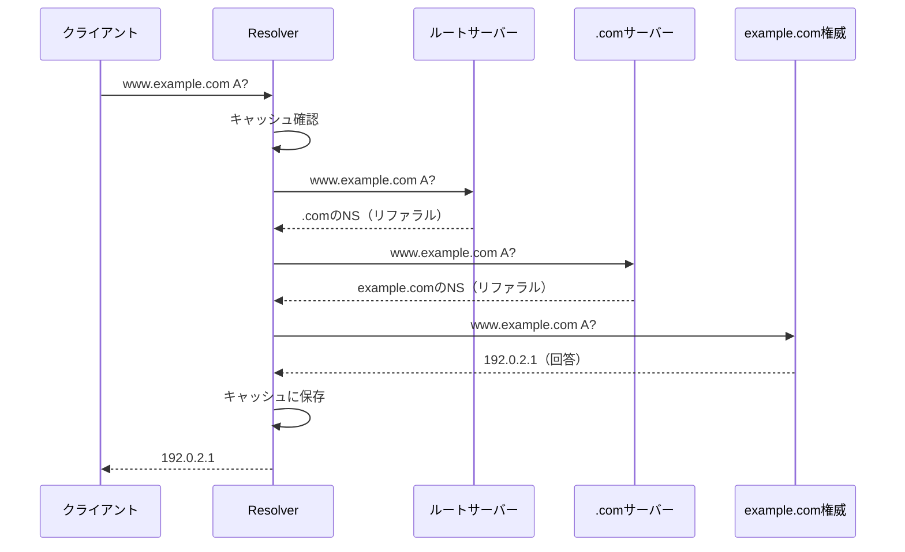

# resolverパッケージとresolvedの実装

`resolver`パッケージは再帰リゾルバの実装を提供し、`cmd/resolved`はDNSサーバーとして動作するCLIツールです。

## 1. パッケージ間の責務

| 処理 | 担当パッケージ |
|---|---|
| DNSメッセージのエンコード/デコード | message |
| DNSサーバーへのクエリ送受信 | client |
| ゾーンファイルのパース・レコード検索 | zone |
| 権威サーバーとしての応答 | server / cmd/authd |
| 再帰的な名前解決・キャッシュ | **resolver / cmd/resolved** |

## 2. ファイル構成

```
resolver/
├── resolver.go  # Resolver構造体と再帰解決ロジック
├── cache.go     # TTLベースのキャッシュ
└── hints.go     # ルートサーバーのアドレス一覧

cmd/resolved/
└── main.go      # 再帰リゾルバサーバーのエントリーポイント
```

## 3. 再帰解決の仕組み

### 処理フロー



1. **キャッシュ確認**: まずキャッシュを確認
2. **ルートから開始**: キャッシュになければルートサーバーに問い合わせ
3. **リファラル追跡**: NSレコード（委譲）を受け取ったら、そのサーバーに再度問い合わせ
4. **回答取得**: 最終的な権威サーバーから回答を取得
5. **キャッシュ保存**: 結果をTTLに基づいてキャッシュ

### リファラル（委譲）とは

権威サーバーが「自分は答えを持っていないが、この名前サーバーに聞け」と返す応答。

```
; 質問: www.example.com A?
; ルートサーバーからの応答:

;; AUTHORITY SECTION:
com.    172800  IN  NS  a.gtld-servers.net.
com.    172800  IN  NS  b.gtld-servers.net.

;; ADDITIONAL SECTION:
a.gtld-servers.net.  172800  IN  A  192.5.6.30
b.gtld-servers.net.  172800  IN  A  192.33.14.30
```

- **Authority Section**: 委譲先のNSレコード
- **Additional Section**: NSのIPアドレス（グルーレコード）

## 4. resolverパッケージ

### Resolver構造体

```go
type Resolver struct {
    cache  *Cache
    client *client.Client
}
```

### 主要なAPI

```go
// 新しいリゾルバを作成
res := resolver.NewResolver()

// 名前解決
records, err := res.Resolve(ctx, "example.com", message.TypeA)
```

### キャッシュ

TTLベースのキャッシュを実装。

```go
type Cache struct {
    entries map[string]cacheEntry
}

type cacheEntry struct {
    records   []message.ResourceRecord
    expiresAt time.Time
}
```

- **Get**: キャッシュからレコードを取得（期限切れはnil）
- **Set**: レコードをキャッシュに追加
- **Cleanup**: 期限切れエントリを削除

キャッシュヒット時はTTLを残り時間に調整して返す。

### ルートヒント

13個のルートサーバーのIPv4アドレスを定義。

```go
var RootServers = []string{
    "198.41.0.4:53",     // a.root-servers.net
    "170.247.170.2:53",  // b.root-servers.net
    // ...
}
```

## 5. cmd/resolved

### 使い方

```bash
# 起動
resolved -addr :5353

# オプション
#   -addr  リッスンアドレス（デフォルト: :5353）
```

### 動作例

```bash
# サーバー起動
./resolved -addr :15354

# 別ターミナルでクエリ
./selfdig example.com @127.0.0.1:15354
```

出力例：

```
; <<>> selfdig 0.1 <<>> @127.0.0.1:15354 example.com A

;; QUESTION SECTION:
;example.com.           	IN	A

;; ANSWER SECTION:
example.com.	300	IN	A	93.184.216.34

;; Query time: 164 msec
;; SERVER: 127.0.0.1:15354
```

2回目のクエリはキャッシュから返されるため高速（0ms）。

## 6. CNAME追跡

CNAMEレコードの場合は自動的に追跡。

```
; www.example.com が cdn.example.net を指すCNAMEの場合

;; ANSWER SECTION:
www.example.com.  300  IN  CNAME  cdn.example.net.
cdn.example.net.  300  IN  A      198.51.100.1
```

## 7. エラーハンドリング

| 状況 | RCode |
|------|-------|
| 正常解決 | NOERROR |
| 名前が存在しない | NXDOMAIN |
| 解決失敗 | SERVFAIL |
| 未対応のOpcode | NOTIMP |

## 8. 制限事項

| 項目 | 制限 |
|------|------|
| 最大再帰深さ | 16 |
| クエリタイムアウト | 2秒/サーバー |
| 全体タイムアウト | 10秒 |

## 9. 今後の拡張

| 機能 | 説明 |
|------|------|
| ネガティブキャッシュ | NXDOMAINの結果もキャッシュ |
| IPv6対応 | AAAAグルーレコードの使用 |
| DNSSEC検証 | 署名の検証 |
| プリフェッチ | TTL切れ前に事前更新 |
