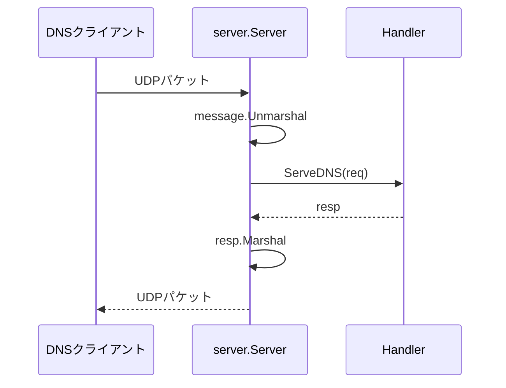

# serverパッケージとauthdの実装

`server`パッケージはUDP DNSサーバーの基盤を提供し、`cmd/authd`は権威DNSサーバーとして動作するCLIツールです。

## 1. パッケージ間の責務

| 処理 | 担当パッケージ |
|---|---|
| DNSメッセージのエンコード/デコード | message |
| DNSサーバーへのクエリ送受信 | client |
| ゾーンファイルのパース・レコード検索 | zone |
| UDP受信・送信の基盤 | **server** |
| 権威サーバーとしてのクエリ応答 | **cmd/authd** |
| 反復的な名前解決・キャッシュ | resolver / cmd/resolved |

## 2. ファイル構成

```
server/
└── server.go       # Server構造体とHandler インターフェース

cmd/authd/
└── main.go         # 権威DNSサーバーのエントリーポイントとAuthHandler
```

## 3. serverパッケージ

### 型の説明

| Go型 | 役割 |
|---|---|
| `Handler` | DNSリクエストを処理してレスポンスを返すインターフェース |
| `HandlerFunc` | 関数をHandlerとして使えるようにするアダプタ |
| `Server` | UDPサーバー。リクエストを受信しHandlerに委譲する |

### Handler インターフェース

```go
type Handler interface {
    ServeDNS(req *message.Message) *message.Message
}
```

リクエストを受け取り、レスポンスを返す。`nil`を返した場合、クライアントには何も送信されない。

### Server構造体

```go
type Server struct {
    Addr    string  // リッスンするアドレス（例: ":53", "127.0.0.1:5353"）
    Handler Handler // リクエストハンドラ
}
```

### APIの使い方

```go
srv := &server.Server{
    Addr:    ":5353",
    Handler: myHandler,
}

// 起動（ブロック）
err := srv.ListenAndServe()

// 停止
ctx, cancel := context.WithTimeout(context.Background(), 5*time.Second)
defer cancel()
srv.Shutdown(ctx)
```

### 処理フロー



1. **受信**: `ReadFrom`でUDPパケットを受信
2. **デコード**: `message.Unmarshal`でパース
3. **ハンドラ呼び出し**: `Handler.ServeDNS`を呼び出し
4. **エンコード**: `resp.Marshal`でバイト列に変換
5. **送信**: `WriteTo`でクライアントに送信

各リクエストはゴルーチンで並行処理される。

### グレースフルシャットダウン

`Shutdown`メソッドは以下を行う：

1. 新規リクエストの受け付けを停止
2. 処理中のリクエストの完了を待機
3. コンテキストがキャンセルされた場合は即座に終了

## 4. cmd/authd

### 使い方

```bash
# 起動
authd -zone testdata/example.com.zone -addr :5353

# オプション
#   -zone  ゾーンファイルのパス（必須）
#   -addr  リッスンアドレス（デフォルト: :5353）
```

### AuthHandler

`AuthHandler`はゾーンファイルを元にクエリに応答する。

```go
type AuthHandler struct {
    zone *zone.Zone
}

func (h *AuthHandler) ServeDNS(req *message.Message) *message.Message {
    // 1. 標準クエリ以外は NOTIMP
    // 2. 管轄外のクエリは REFUSED
    // 3. ゾーンからレコードを検索
    // 4. レスポンスを構築して返す
}
```

### レスポンスの構築

| 状況 | RCode | 説明 |
|------|-------|------|
| レコードが見つかった | NOERROR | Answerセクションにレコードを含める |
| 名前は存在するがタイプがない | NOERROR | Answerは空、AuthorityにSOAを含める |
| 名前が存在しない | NXDOMAIN | Answerは空、AuthorityにSOAを含める |
| 管轄外 | REFUSED | このゾーンでは応答しない |
| 未対応のOpcode | NOTIMP | 標準クエリ以外は未実装 |

### 動作例

```bash
# サーバー起動
./authd -zone testdata/example.com.zone -addr :15353

# 別ターミナルでクエリ
./selfdig www.example.com @127.0.0.1:15353
```

出力例：

```
; <<>> selfdig 0.1 <<>> @127.0.0.1:15353 www.example.com A

;; QUESTION SECTION:
;www.example.com.       	IN	A

;; ANSWER SECTION:
www.example.com.	3600	IN	A	192.0.2.10

;; Query time: 0 msec
;; SERVER: 127.0.0.1:15353
;; MSG SIZE rcvd: 64
```

### CNAME追跡

`blog.example.com`がCNAMEで`www.example.com`を指している場合、Aレコードのクエリに対してCNAMEと最終的なAレコードの両方を返す。

```
;; ANSWER SECTION:
blog.example.com.	3600	IN	CNAME	www.example.com.
www.example.com.	3600	IN	A	192.0.2.10
```

### シグナルハンドリング

SIGINT（Ctrl+C）またはSIGTERMを受け取ると、グレースフルシャットダウンを行う。

## 5. サンプルゾーンファイル

`testdata/example.com.zone`:

```
$ORIGIN example.com.
$TTL 3600

@       IN      SOA     ns1.example.com. admin.example.com. (
                        2024010101  ; シリアル番号
                        3600        ; リフレッシュ
                        900         ; リトライ
                        604800      ; 有効期限
                        86400       ; ネガティブTTL
                        )

@       IN      NS      ns1.example.com.
@       IN      NS      ns2.example.com.

@       IN      A       192.0.2.1
ns1     IN      A       192.0.2.2
ns2     IN      A       192.0.2.3
www     IN      A       192.0.2.10

www     IN      AAAA    2001:db8::10

blog    IN      CNAME   www.example.com.

@       IN      MX      10 mail.example.com.
mail    IN      A       192.0.2.20

@       IN      TXT     "v=spf1 mx -all"
```

## 6. 今後の拡張

| 機能 | 説明 |
|------|------|
| TCP対応 | 512バイト超のレスポンス、ゾーン転送 |
| 複数ゾーン | 複数のゾーンファイルを読み込み |
| 動的リロード | SIGHUPでゾーンファイルを再読み込み |
| ロギング強化 | クエリログ、メトリクス出力 |
