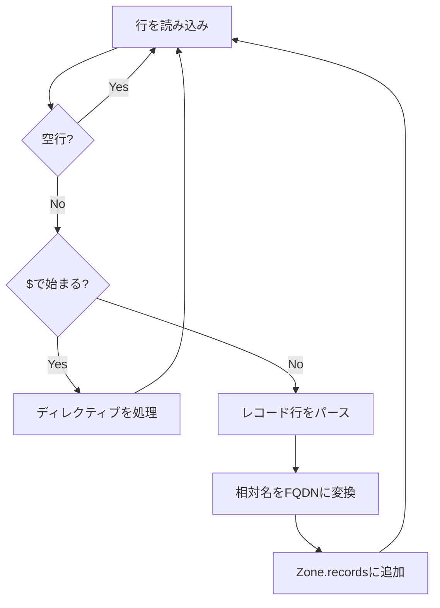

# zoneパッケージの実装

`zone`パッケージは権威DNSサーバーの中核として、ゾーンファイルをパースしてレコードを保持し、クエリに応じてレコードを返す役割を担う。

## 1. `zone`の責務

| 処理 | 担当パッケージ |
|---|---|
| DNSメッセージのエンコード/デコード | message |
| DNSサーバーへのクエリ送受信 | client |
| ゾーンファイルのパース・レコード検索 | **zone** |
| 権威サーバーとしての応答 | server（今後実装） |
| 反復的な名前解決・キャッシュ | resolver（今後実装） |

## 2. ファイル構成

```
zone/
├── zone.go      # Zone構造体とLookupメソッド
├── parser.go    # ゾーンファイルパーサー
├── errors.go    # エラー定義
└── zone_test.go # テストコード
```

## 3. 型の説明

| Go型 | 役割 |
|---|---|
| `Zone` | ゾーン全体を表す。オリジン、デフォルトTTL、レコードのmapを保持 |

### Zone構造体

```go
type Zone struct {
    Origin  string                                  // ゾーンのオリジン（例: "example.com."）
    TTL     uint32                                  // デフォルトTTL
    records map[string][]message.ResourceRecord    // 名前 → レコード群
}
```

## 4. APIの使い方

### ゾーンファイルのパース

```go
f, _ := os.Open("example.com.zone")
defer f.Close()

z, err := zone.Parse(f)
if err != nil {
    log.Fatal(err)
}

fmt.Println(z.Origin) // "example.com."
```

### レコードの検索

```go
// CNAME追跡ありの検索
records := z.Lookup("www.example.com.", message.TypeA)

// CNAME追跡なしの検索
records := z.LookupExact("www.example.com.", message.TypeA)

// 指定した名前の全レコード
records := z.LookupAll("www.example.com.")
```

### ゾーンのメタデータ取得

```go
// SOAレコード
soa := z.SOA()

// NSレコード群
ns := z.NS()

// ゾーンの管轄判定
if z.IsAuthoritative("www.example.com.") {
    // このゾーンで応答可能
}
```

## 5. 対応するゾーンファイル形式

### ディレクティブ

| ディレクティブ | 意味 |
|---------------|------|
| `$ORIGIN` | ゾーンのオリジン（相対名の基準） |
| `$TTL` | デフォルトTTL |

### レコードタイプ

| タイプ | 例 |
|--------|-----|
| A | `www IN A 192.0.2.1` |
| AAAA | `www IN AAAA 2001:db8::1` |
| NS | `@ IN NS ns1.example.com.` |
| CNAME | `alias IN CNAME www` |
| MX | `@ IN MX 10 mail` |
| TXT | `@ IN TXT "v=spf1 ..."` |
| SOA | `@ IN SOA ns1 admin (...)` |

### サンプルゾーンファイル

```
$ORIGIN example.com.
$TTL 3600

; SOAレコード
@       IN  SOA   ns1.example.com. admin.example.com. (
                  2024010101  ; Serial
                  3600        ; Refresh
                  900         ; Retry
                  604800      ; Expire
                  86400       ; Minimum TTL
)

; NSレコード
@       IN  NS    ns1.example.com.
@       IN  NS    ns2.example.com.

; Aレコード
@       IN  A     192.0.2.1
www     IN  A     192.0.2.2

; MXレコード
@       IN  MX    10 mail.example.com.

; CNAMEレコード
ftp     IN  CNAME www
```

## 6. パーサーの処理フロー



### 名前の正規化

| 入力 | 変換後 |
|------|--------|
| `@` | オリジン（例: `example.com.`） |
| `www` | `www.example.com.`（オリジンを付加） |
| `ns1.example.com.` | そのまま（FQDNは変換しない） |

### TTLの単位

| 単位 | 意味 |
|------|------|
| `s` | 秒 |
| `m` | 分（60秒） |
| `h` | 時（3600秒） |
| `d` | 日（86400秒） |
| `w` | 週（604800秒） |

例: `1h30m` = 5400秒

## 7. Lookupのロジック

### CNAME追跡

`Lookup`メソッドはCNAMEを自動的に追跡する。

```
example.com.zone:
  www     IN  A      192.0.2.1
  ftp     IN  CNAME  www

Lookup("ftp.example.com.", TypeA) の結果:
  1. ftp.example.com. CNAME www.example.com.
  2. www.example.com. A     192.0.2.1
```

追跡は最大8段階まで（無限ループ防止）。

### LookupExact

`LookupExact`はCNAMEを追跡せず、指定した名前とタイプに完全一致するレコードのみ返す。

## 8. エラーハンドリング

### センチネルエラー

| エラー | 意味 |
|---|---|
| `ErrMissingOrigin` | `$ORIGIN`ディレクティブがない |
| `ErrMissingSOA` | SOAレコードがない |
| `ErrMultipleSOA` | SOAレコードが複数ある |

### パースエラー

行番号付きのエラーメッセージを返す。

```
line 15: invalid RDATA for A: invalid IPv4 address: not.an.ip
```

## 9. 今後の拡張

| 機能 | 説明 |
|------|------|
| `$INCLUDE` | 他のゾーンファイルをインクルード |
| ワイルドカード | `*.example.com`のサポート |
| 動的更新 | RFC 2136 Dynamic Updates |
