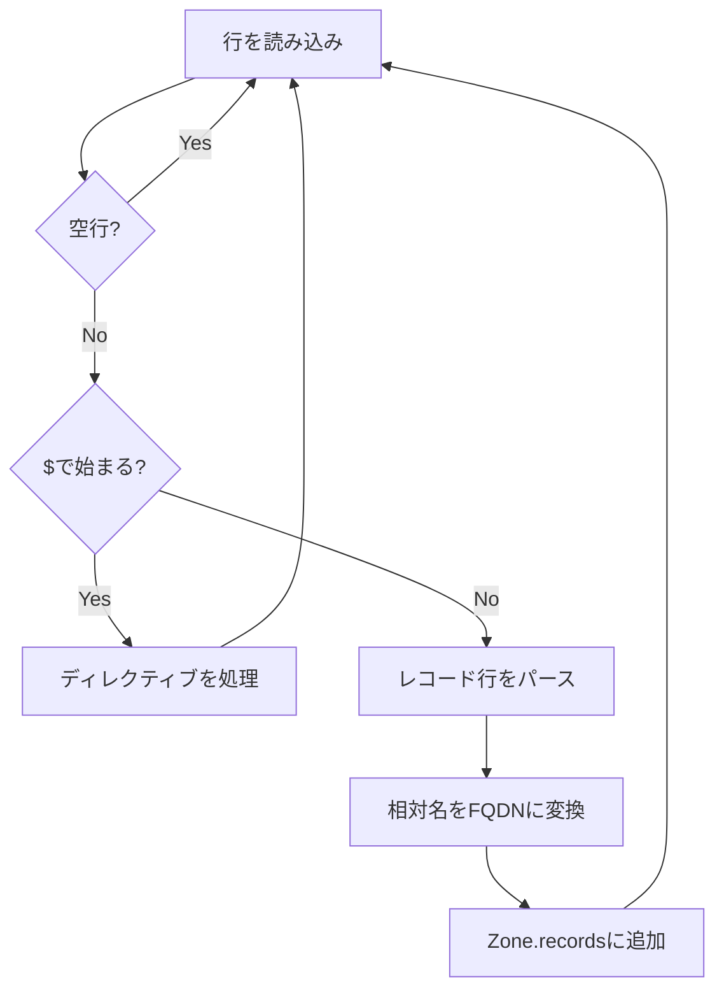

# zoneパッケージの実装

`zone`パッケージは権威DNSサーバーの中核として、ゾーンファイルをパースしてレコードを保持し、クエリに応じてレコードを返す役割を担っています。ゾーンファイルは、権威DNSサーバーに配置され、ドメインネームとIPアドレスの対応関係や管理情報を保持しています。

```bash
zone/
├── zone.go      # Zone構造体とLookupメソッド
├── parser.go    # ゾーンファイルパーサー
└── errors.go    # エラー定義
```


## ゾーンファイル
DNSにおけるゾーンファイルとは、自分の管理する範囲内におけるIPアドレスとドメイン名の対応表が記載されているのプレーンテキストファイルことです。ゾーン内の全てのドメインの全てのレコードが含まれています。

```txt: example.com.zone
$ORIGIN example.com.
$TTL 3600

; SOAレコード
@       IN  SOA   ns1.example.com. admin.example.com. (
                  2024010101  ; Serial
                  3600        ; Refresh
                  900         ; Retry
                  604800      ; Expire
                  86400       ; Minimum TTL
)

; NSレコード
@       IN  NS    ns1.example.com.
@       IN  NS    ns2.example.com.

; Aレコード
@       IN  A     192.0.2.1
www     IN  A     192.0.2.2

; MXレコード
@       IN  MX    10 mail.example.com.

; CNAMEレコード
ftp     IN  CNAME www
```

https://www.infraexpert.com/study/tcpip23.html

`$ORIGIN`は、ゾーンファイル内で**省略された名前(相対名)を補完するための「基準点」** を宣言するディレクティブです。実際にDNSサーバーに問い合わせが来たときに使われるレコードではなく、**ファイルを書く人・パースするプログラムのための省略記法のルール** です。

つまり、ファイルの中で`$ORIGIN example.com.`と記載した場合、それ以降に出てくる末尾にドットがない名前はすべて自動的に `.example.com.` が補完されることになります。

質問のファイルを展開すると、実際にはこう解釈されます。
```
@       →  example.com.      (@ は $ORIGIN そのものを表す特殊記号)
ns1     →  ns1.example.com.
ns2     →  ns2.example.com.
www     →  www.example.com.
blog    →  blog.example.com.
mail    →  mail.example.com.
```

つまり、`@       IN      A       192.0.2.1`は実際には、`example.com.   IN  A   192.0.2.1`と解釈されます。
`$TTL`では、TTLでDNSサーバがゾーンファイルのデータをキャッシュする時間を指定します。

| タイプ | 例 |
|--------|-----|
| A | `www IN A 192.0.2.1` |
| AAAA | `www IN AAAA 2001:db8::1` |
| NS | `@ IN NS ns1.example.com.` |
| CNAME | `alias IN CNAME www` |
| MX | `@ IN MX 10 mail` |
| TXT | `@ IN TXT "v=spf1 ..."` |
| SOA | `@ IN SOA ns1 admin (...)` |

`CNAME`レコードは値の中身が「IPアドレス」ではなく「別の名前」のため、他のタイプと比べて書き方が少し特殊です。`blog    IN      CNAME   www.example.com.`と書かれていた場合、`blog.example.com` について聞かれたら、`www.example.com` の方を見てくださいという転送・別名指定のレコードになります。

処理の流れとしては、このゾーンファイルを起点に、解析を行い、権威サーバー（`authd`）がクライアントからのクエリに応答します。
```
  ┌─────────────────────────────────────────────────────────────────┐
  │  testdata/example.com.zone（テキストファイル）                     │
  │  ─────────────────────────────────────────────────────────────  │
  │  $ORIGIN example.com.                                           │
  │  $TTL 3600                                                      │
  │  @   IN  SOA  ns1.example.com. admin.example.com. (...)         │
  │  @   IN  NS   ns1.example.com.                                  │
  │  www IN  A    192.0.2.10                                        │
  └─────────────────────────────────────────────────────────────────┘
                                │
                                ▼ Parse()
  ┌─────────────────────────────────────────────────────────────────┐
  │  zone/parser.go                                                 │
  │  ─────────────────────────────────────────────────────────────  │
  │  1. ディレクティブ処理 ($ORIGIN, $TTL)                             │
  │  2. 各レコード行をトークン分割                                      │
  │  3. NAME, TTL, CLASS, TYPE, RDATA を解析                         │
  │  4. message.ResourceRecord 構造体を生成                           │
  └─────────────────────────────────────────────────────────────────┘
                                │
                                ▼ zone.AddRecord()
  ┌─────────────────────────────────────────────────────────────────┐
  │  zone/zone.go（Zone構造体）                                       │
  │  ─────────────────────────────────────────────────────────────  │
  │  Zone{                                                          │
  │    Origin: "example.com."                                       │
  │    TTL:    3600                                                 │
  │    records: map[string][]ResourceRecord{                        │
  │      "example.com.":     [{SOA...}, {NS...}, {A...}, {MX...}]   │
  │      "www.example.com.": [{A: 192.0.2.10}, {AAAA: 2001:db8::10}]│
  │      "blog.example.com.":[{CNAME: www.example.com.}]            │
  │    }                                                            │
  │  }                                                              │
  └─────────────────────────────────────────────────────────────────┘
                                │
                                ▼ zone.Lookup()
  ┌─────────────────────────────────────────────────────────────────┐
  │  権威サーバー（authd）がクエリに応答                                 │
  └─────────────────────────────────────────────────────────────────┘
```

## ゾーンファイルのパース処理

`parse.go`でゾーンファイル を行ごとにスキャンして、クライアントのクエリのレスポンスを返却するために`Origin、TTL、records`の形に整形します。
```go: parse.go
func (p *parser) parse() (*Zone, error) {
	var records []message.ResourceRecord

	for p.scanner.Scan() {
		p.lineNum++
		line := p.scanner.Text()

		// 複数行にまたがるレコード（括弧）の処理
		line = p.handleMultiline(line)
		if line == "" {
			continue
		}

		// コメントを除去
		line = p.stripComment(line)
		line = strings.TrimSpace(line)

		if line == "" {
			continue
		}

		// ディレクティブの処理
		if strings.HasPrefix(line, "$") {
			if err := p.parseDirective(line); err != nil {
				return nil, fmt.Errorf("line %d: %w", p.lineNum, err)
			}
			continue
		}

		// レコード行のパース
		rr, err := p.parseRecord(line)
		if err != nil {
			return nil, fmt.Errorf("line %d: %w", p.lineNum, err)
		}
		if rr != nil {
			if rr.Type == message.TypeSOA {
				p.soaCount++
			}
			records = append(records, *rr)
		}
	}

	if err := p.scanner.Err(); err != nil {
		return nil, fmt.Errorf("scan error: %w", err)
	}

	// 検証
	if p.origin == "" {
		return nil, ErrMissingOrigin
	}
	if p.soaCount == 0 {
		return nil, ErrMissingSOA
	}
	if p.soaCount > 1 {
		return nil, ErrMultipleSOA
	}

	// Zone構築
	zone := NewZone(p.origin, p.defaultTTL)
	for _, rr := range records {
		zone.AddRecord(rr)
	}
	return zone, nil
}
```
`p.scanner.Scan()`でゾーンファイルを読み取り、ディレクティブ処理（`$ORIGIN`をp.origin に設定 例: example.com.する処理）を行います。`$TTL`は`p.defaultTTL` に設定します（例: 3600）。最終的にZone構造体を構築してきます。


```mermaid
flowchart TD
    A[行を読み込み] --> B{空行?}
    B -->|Yes| A
    B -->|No| C{$で始まる?}
    C -->|Yes| D[ディレクティブを処理]
    D --> A
    C -->|No| E[レコード行をパース]
    E --> F[相対名をFQDNに変換]
    F --> G[Zone.recordsに追加]
    G --> A
```


## レコードの検索

名前とタイプでレコードを検索します。

```go: zone.go
func (z *Zone) lookupWithCNAME(name string, typ message.Type, depth int) []message.ResourceRecord {
	const maxDepth = 8 // CNAME追跡の上限

	if depth > maxDepth {
		return nil
	}

	// 完全一致で検索
	records := z.LookupExact(name, typ)
	if len(records) > 0 {
		return records
	}

	// CNAMEを探す（要求されたタイプがCNAME以外の場合）
	if typ != message.TypeCNAME {
		cnames := z.LookupExact(name, message.TypeCNAME)
		if len(cnames) > 0 {
			// CNAMEの先を追跡
			result := make([]message.ResourceRecord, 0, len(cnames))
			result = append(result, cnames...)

			for _, cname := range cnames {
				if cnameData, ok := cname.RData.(message.CNAMEData); ok {
					target := string(cnameData.CName)
					result = append(result, z.lookupWithCNAME(target, typ, depth+1)...)
				}
			}
			return result
		}
	}

	return nil
}

// 完全一致でレコードを検索する（CNAME追跡なし）
func (z *Zone) LookupExact(name string, typ message.Type) []message.ResourceRecord {
	name = z.normalizeName(name)
	allRecords := z.records[name]

	var result []message.ResourceRecord
	for _, rr := range allRecords {
		if rr.Type == typ {
			result = append(result, rr)
		}
	}
	return result
}
```
CNAMEレコード(`www.example.com.  CNAME  web.example.com.`)の場合、別名が定義されています。例えば、 `www.example.com の A レコード`を問い合わせた場合、まず別名を返却し(`www.example.com → CNAME → web.example.com`)、追跡して実際のIPを取得します(`web.example.com → A → 192.0.2.1 `)。結果として、CNAMEレコード と Aレコードの両方が返却されます。

```go
 // 1. まず要求された型で直接検索（要求されたレコードが見つからない場合、CNAMEを探す）
  records := z.LookupExact(name, typ)
  if len(records) > 0 {
      return records  // 見つかればそれを返す
  }

  // 2. 見つからなければCNAMEを探す
  if typ != message.TypeCNAME {
      cnames := z.LookupExact(name, message.TypeCNAME)
      if len(cnames) > 0 {
          // CNAMEの先を再帰的に追跡（CNAMEが指す名前で検索を再開する）
          result = append(result, cnames...)
          result = append(result, z.lookupWithCNAME(target, typ, depth+1)...)
      }
  }
```


`IsAuthoritative` 関数で指定した名前がこのゾーンの管轄かどうかを判定します。
```go
func (z *Zone) IsAuthoritative(name string) bool {
    name = z.normalizeName(name)
    return name == z.Origin || strings.HasSuffix(name, "."+z.Origin)
}
```

例えば `dig example.com A` のようなクエリの場合、以下のように判定が可能です。
```
Origin: "example.com."
 Query:  "www.example.com."   → ".example.com." で終わる → 管轄内 ✓
 Query:  "mail.example.com."  → ".example.com." で終わる → 管轄内 ✓
 Query:  "a.b.example.com."   → ".example.com." で終わる → 管轄内 ✓
 Query:  "example.org."       → ".example.com." で終わらない → 管轄外 ✗
 Query:  "fakeexample.com."   → ".example.com." で終わらない → 管轄外 ✗
```

DNSの階層構造に基づいて、末尾一致 = 名前が.example.com.で終わるかでどこの管轄がわかるようになっています。
```bash
           . (root)
              │
         ┌────┴────┐
        com.      org.
         │
    example.com.     ← このゾーンが管轄
    ┌────┼────┐
   www  mail  ns1    ← すべてサブドメイン = 管轄内

ゾーンの管轄範囲 = そのドメイン自身 + すべてのサブドメイン

つまりexample.com.ゾーンは：
- example.com. 自身
- *.example.com.（任意の深さのサブドメイン）
```

日常では省略されていまsが、`example.com.`の末尾のドットはドメインの終端を示す記号を意味しています。末尾のドットを忘れると、意図しないドメイン名になることがあります。

https://qiita.com/tobari_ko/items/1310384f7b6b24d01fc7

```bash
; ゾーンファイル内（$ORIGIN example.com. の場合）
  www           →  www.example.com.  （相対名：自動で$ORIGINが付く）
  mail.example.com.  →  mail.example.com.  （FQDN、そのまま）
  mail.example.com   →  mail.example.com.example.com.  （間違い）
```

---

## 参考文献

- [RFC1034] Mockapetris, P., "Domain Names - Concepts and Facilities", STD 13, RFC 1034, November 1987.
  https://www.rfc-editor.org/rfc/rfc1034
- [RFC1035] Mockapetris, P., "Domain Names - Implementation and Specification", STD 13, RFC 1035, November 1987.
  https://www.rfc-editor.org/rfc/rfc1035
